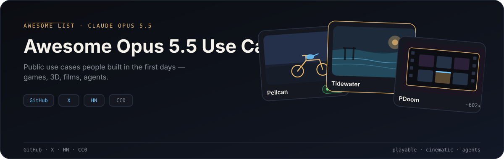

  

  
  
  

A curated gallery of **public Claude Opus 5.5 use cases** — playable games, interactive 3D, films, and agents — collected from GitHub, X, and Hacker News.

*Claude Opus 5.5 公开用例精选：游戏、3D、影像与 Agent 作品合集。*

**Claude Opus 5.5** launched on **2026-09-22** as the first model in Anthropic’s Claude 5.5 family. Within days, builders shipped playable Three.js games, cinematic browser films, multi-agent harnesses, and same-prompt A/B benches. This list tracks the most interesting public use cases.

---

## Featured

Start here — strongest public use cases with live links where available.

- **[Pelican on a Bike](https://github.com/riba2534/claude-opus-5-5-demo)** — Viral Three.js pelican-on-a-bike game (~764★). **[▶ Live demo](https://claude-opus-5-5.riba2534.cn/)** · [HN](https://news.ycombinator.com/item?id=49812241)
- **[Rain on Glass](https://rain-on-glass-production.up.railway.app)** — Interactive foggy-window rain scene. **[▶ Live](https://rain-on-glass-production.up.railway.app)** · [X post](https://x.com/HixonStudio/status/2102511610518774178)
- **[Turbo Kart Rally](https://github.com/bridge-mind/turbo-kart-rally)** — Mario Kart–style arcade racer in Three.js with fully procedural assets
- **[Tidewater](https://github.com/dgreenheck/tidewater)** — Atmospheric coastal town scene built end-to-end with Opus 5.5 (~275★)
- **[PDoomVideo](https://github.com/JohnHeibel/PDoomVideo)** — Source for the *I’m Upping My P(doom)* music video (~602★)

---

## Contents

- [Featured](#featured)
- [Official / launch](#official--launch)
- [Interactive 3D & Games](#interactive-3d--games)
- [Creative coding / films / animation](#creative-coding--films--animation)
- [Agent / engineering demos](#agent--engineering-demos)
- [Collections & prompt lists](#collections--prompt-lists)
- [Benchmarks & analysis](#benchmarks--analysis)
- [Notable X / HN showcases](#notable-x--hn-showcases)
- [Contributing](#contributing)
- [License](#license)

---

## Official / launch

- [Claude Opus 5.5 — Anthropic](https://www.anthropic.com/claude-opus-5-5) — Official product page for the first Claude 5.5-family model (launched 2026-09-22). [HN discussion](https://news.ycombinator.com/item?id=49803863)
- [Getting the most out of Opus 5.5](https://claude.dev/blog/getting-the-most-out-of-opus-5-5/) — Official tips on how to prompt and operate the model effectively

---

## Interactive 3D & Games

Playable scenes and games built with Opus 5.5 — live links included when publicly hosted.

- [Pelican on a Bike](https://github.com/riba2534/claude-opus-5-5-demo) — Viral Three.js pelican-on-a-bike game (~764★). **[Live demo](https://claude-opus-5-5.riba2534.cn/)** · [HN: Claude Opus 5.5 – Pelican Game](https://news.ycombinator.com/item?id=49812241)
- [Tidewater](https://github.com/dgreenheck/tidewater) — Atmospheric coastal town scene built end-to-end with Opus 5.5 (~275★)
- [Turbo Kart Rally](https://github.com/bridge-mind/turbo-kart-rally) — Mario Kart–style arcade racer in Three.js with fully procedural assets (BridgeMind / X buzz via `@0x0SojalSec`)
- [OpusSkate](https://github.com/OminousIndustries/OpusSkate) — Native C++ skateboarding game authored by Opus 5.5
- [Dead Signal (zombies FPS)](https://github.com/bridge-mind/claude-opus-5.5-zombies-game) — Browser extraction-survival zombie shooter built with Three.js and TypeScript
- [Nova Lancer](https://github.com/tanuu5/nova-lancer) — Star Fox–inspired 3D rail shooter with procedural terrain, models, music, and SFX
- [Nagi Home](https://github.com/tanuu5/nagi-home) — Cozy crab-home life simulation (カニのナギ) created with Claude Opus 5.5
- [Sprout Quest](https://github.com/aibengineering/sprout-quest) — Cute mobile adventure with arena battles, crafting, village building, and Blender-rendered 3D art
- [Tatertots Flight Sim](https://github.com/JaredTate/tatertotsflightsim) — Early Opus 5.5 flight-simulator test build
- [Qingming Bianjing A/B](https://github.com/SilentFleetKK/qingming-bianjing) — Realtime 3D *Qingming Shanghe Tu* city: same prompt, Opus 5.5 vs GPT-6 Sol
- [Clearwater](https://github.com/Aureliengmz/clearwater) — Single-file WebGL2 photoreal shallow water with FFT waves, interactive ripples, and caustics, co-authored with Opus 5.5 (~375★). **[Live demo](https://aureliengmz.github.io/clearwater/)**
- [Sakura river-valley boat (Meng To)](https://x.com/MengTo/status/2102760783344189761) — Playable Three.js riverboat ride through a feudal Japanese mountain valley with painterly water and weather. **[Live demo](https://valley.mengto.here.now)**
- [Foldline](https://x.com/chetanankola/status/2103001194696458512) — Watercolor-and-ink Three.js road that folds up walls and into sheet music you steer through to play each street's melody (`@chetanankola`)
- [Slide Rush](https://github.com/KJLKurt/waterslide-game-opus-5.5) — Mobile-first Three.js waterslide racer against 12 AI rivals, built at extra-high effort. **[Live demo](https://kjlkurt.github.io/waterslide-game-opus-5.5/)**
- [Fishslop](https://github.com/vasu-devs/FishSlop_Opus5.5) — Underwater reef-keeping Three.js game with a bathyscaphe, procedural fish, sonar, and an upgrade economy. **[Live demo](https://vasu-devs.github.io/FishSlop_Opus5.5/)**

---

## Creative coding / films / animation

Music videos, JS-directed films, canvas loops, and generative art demos.

- [PDoomVideo](https://github.com/JohnHeibel/PDoomVideo) — Source for the *I’m Upping My P(doom)* music video (~602★)
- [Functional Emotions video](https://github.com/ledbetterljoshua/functional-emotions-video) — Painted music video with a custom GPU brushstroke renderer and seven parallel chapter agents
- [opus-js-animations](https://github.com/klsoen/opus-js-animations) — Claude Code skill where Opus 5.5 directs and renders frame-exact JS films (brief → sound → treatment → MP4)
- [BJTU Touhou booth](https://github.com/fish2lab/bjtu-touhou-booth) — 4K looping woodcut-style Touhou booth film; every frame is Canvas code
- [claude-horizon-animation](https://github.com/misbahsy/claude-horizon-animation) — Skill that generates Claude Opus 5.5 announcement-style horizon animations
- [Rain on Glass](https://rain-on-glass-production.up.railway.app) — Interactive foggy-window rain scene. **[Live](https://rain-on-glass-production.up.railway.app)** · [X post](https://x.com/HixonStudio/status/2102511610518774178)
- [echohive Ozymandias](https://www.echohive.ai/ozymandias) — Cinematic browser animation of Shelley’s *Ozymandias*
- [echohive TSP portrait art](https://www.echohive.ai/tsp-art) — Generative TSP portrait art demo in the browser
- [LaunchVideo](https://github.com/diggerhq/shipvideo) — Paste a URL or prompt and Opus 5.5 writes an HTML film that is rendered frame-by-frame into an MP4 (~96★). **[Live](https://launchvideo.io)** · [HN](https://news.ycombinator.com/item?id=49836374)
- [Opus 5.5 vs Astra motion showreel](https://x.com/shneural/status/2103151003272962130) — Same one-shot prompt; Opus built a Python/Skia + Blender pipeline for a 15-second code-drawn motion piece (`@shneural`)
- [3blue1brown-style paper explainer](https://x.com/deedydas/status/2103141339651350646) — Eight-minute code-rendered video summary of a research paper generated with Opus 5.5 (`@deedydas`)
- [The Golden Ford](https://www.echohive.ai/experiments/the-golden-ford) — Interactive 2.5D multiplane parallax battle scene across six painted acts. **[Live](https://www.echohive.ai/experiments/the-golden-ford)** · [HN](https://news.ycombinator.com/item?id=49835099)

---

## Agent / engineering demos

Harnesses, one-shot codebases, orchestrators, and large HTML/web batches.

- [LiveNerf](https://github.com/ninjahawk/livenerf) — Public benchmark for tracking whether Opus 5.5 capability drifts after release (Show HN style)
- [fable5-opus5.5-orchestrator](https://github.com/Rylaa/fable5-opus5.5-orchestrator) — Token-frugal multi-agent Claude Code orchestrator with tier routing and guard hooks (~73★)
- [chemrs](https://github.com/bddap-bot/chemrs) — Idiomatic Rust cheminformatics toolkit written one-shot by Opus 5.5
- [opus-55-10k-websites](https://github.com/Barty-Bart/opus-55-10k-websites) — Cinematic drone fly-through brand sites powered by Opus 5.5 + Higgsfield MCP prompts
- [100 HTML Files](https://github.com/MiaAI-Lab/Claude-Opus-5.5-100-HTML-Files) — One hundred self-contained HTML pages with gallery screenshots and the exact prompts used
- [Bosphore 1819](https://github.com/CahidArda/bosphore-1819) — Opus 5.5 subagents transcribe, map, and translate all 387 labels on an 1819 French map of the Bosphorus. **[Live](https://bosphore-1819.vercel.app)** · [HN](https://news.ycombinator.com/item?id=49836367)

---

## Collections & prompt lists

Related awesome lists and prompt packs (some cover adjacent models — noted inline).

- [awesome-opus-5.5-games](https://github.com/AgentsLoop/awesome-opus-5.5-games) — Curated list of ~300 source-verified AI-built games
- [awesome-opus-5-5-prompts](https://github.com/TripoGrowthLab/awesome-opus-5-5-prompts) — Opus 5.5 prompts for 3D scenes, games, animation, and simulations (multi-language)
- [frontier-games](https://github.com/theolundqvist/frontier-games) — Best games and films from Opus 5.5 and GPT-6 Astra, sorted by how fast you can try them
- [awesome-opus5-use-cases](https://github.com/Evolink-AI/awesome-opus5-use-cases) — Source-backed use cases for **Claude Opus 5** (older release; related, not 5.5-specific)
- [opus55-demolar](https://github.com/fornhere/opus55-demolar) — Fourteen visual demos with prompts (Turkish)
- [opus-100-projects](https://github.com/swan4er/opus-100-projects) — Gallery of 121 interactive 3D, game, and cartoon projects assembled by Opus 5.5 in one autonomous run. **[Live gallery](https://swan4er.github.io/opus-100-projects/)**
- [awesome-opus-5-5-videos](https://github.com/athemeroy/awesome-opus-5-5-videos) — Source-linked catalog of 1,000+ X videos made with Opus 5.5, labeled by domain, style, and production method
- [awesome-opus5.5-frontend-showcases](https://github.com/OpenVGLab/awesome-opus5.5-frontend-showcases) — SVG games, Lottie, voxel builds, and Three.js scenes, plus original SVG titles like Kitchen Rush and Sunny Kart. **[Live gallery](https://openvglab.github.io/awesome-opus5.5-frontend-showcases/)**

---

## Benchmarks & analysis

Third-party evals, launch-day benches, and model-vs-model writeups.

- [Artificial Analysis — Claude Opus 5.5](https://artificialanalysis.ai/models/claude-opus-5-5) — Intelligence, performance, and price analysis across reasoning settings
- [aiidelist — 8 real-world demos](https://aiidelist.com/blog/claude-opus-5-5-examples) — Roundup of eight concrete Opus 5.5 examples
- [favtutor — 10 things people created](https://favtutor.com/claude-opus-5-5-real-examples/) — Ten real projects people shipped with the model
- [Partforge CAD harness](https://www.partforge.ai/blog/2026-09-23-new-model-day) — New-model-day CAD harness comparing Sol and Opus
- [opus-5.5-benchmarks](https://github.com/avenoxai/opus-5.5-benchmarks) — Launch-day test suite with several head-to-heads against GPT-6
- [war-atlas-a-b](https://github.com/yanqingcheng/war-atlas-a-b) — Same-prompt Mongol war atlas A/B: Opus 5.5 vs GPT-6 Sol
- [Endor Labs — Agent Security League](https://www.endorlabs.com/learn/opus-5-5-6x-cheaper-and-2x-faster-than-fable-5-1-but-memorization-keeps-it-off-the-top-spot) — Claude Code + Opus 5.5 scored 68.7% functional / 33.5% secure code at a $116 full-run cost versus Fable 5.1 and Opus 5

---

## Notable X / HN showcases

Posts and threads that shipped a memorable demo (or sparked a wave of copies).

- [Claude Opus 5.5 – Pelican Game (HN)](https://news.ycombinator.com/item?id=49812241) — HN thread for the live Pelican Three.js demo
- [Sketch→3D home stages](https://x.com/techartist_/status/2102503719762018434) — Three.js + TSL sketch-to-3D home pipeline (`@techartist_`)
- [Hand-drawn chess + analysis](https://x.com/higgsfield_ai/status/2102534514228822197) — Higgsfield hand-drawn chess analysis showcase
- [Rain on Glass (X)](https://x.com/HixonStudio/status/2102511610518774178) — Source post for the interactive foggy-window demo
- [Claude Opus 5.5 (HN, official)](https://news.ycombinator.com/item?id=49803863) — Main launch-day Hacker News thread for Anthropic’s announcement
- [LaunchVideo (HN)](https://news.ycombinator.com/item?id=49836374) — Popular HN thread for the URL-to-launch-film agent
- [Sakura river-valley boat (X)](https://x.com/MengTo/status/2102760783344189761) — Viral Meng To post for the playable river-valley scene (`@MengTo`)
- [Motion showreel A/B (X)](https://x.com/shneural/status/2103151003272962130) — Opus 5.5 vs GPT-6 Astra one-shot showreel comparison (`@shneural`)

---

## Contributing

See [CONTRIBUTING.md](CONTRIBUTING.md). Please add entries with a title, link, one-line description, source (`github` / `x` / `hn` / …), and an optional live demo URL — and keep `data/usecases.json` in sync with the README.

Structured seed data for automation lives in [`data/usecases.json`](data/usecases.json).

### Non-use-case footnote

Pure system-prompt / prompt-leak repositories (for example `asgeirtj/system_prompts_leaks` and `cbrunner/opus-5.5-system-prompt-components`) are intentionally **not** listed in the use-case sections above.

---

## License

[CC0 1.0 Universal](LICENSE) — public domain dedication, standard for awesome lists.
