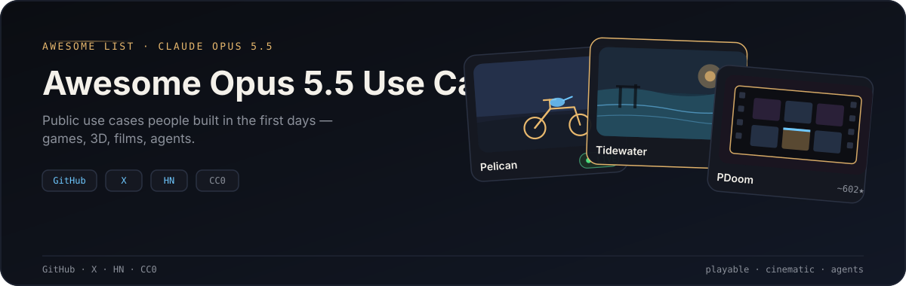

  

  
  
  

A curated gallery of **public Claude Opus 5.5 use cases** — playable games, interactive 3D, films, and agents — collected from GitHub, X, and Hacker News, including a dedicated [Videos (from X)](#videos-from-x) section credited to each creator.

*Claude Opus 5.5 公开用例精选：游戏、3D、影像与 Agent 作品合集。*

**Claude Opus 5.5** launched on **2026-09-22** as the first model in Anthropic’s Claude 5.5 family. Within days, builders shipped playable Three.js games, cinematic browser films, multi-agent harnesses, and same-prompt A/B benches. This list tracks the most interesting public use cases.

---

## Featured

Start here — strongest public use cases with live links where available.

- **[Pelican on a Bike](https://github.com/riba2534/claude-opus-5-5-demo)** — Viral Three.js pelican-on-a-bike game (~764★). **[▶ Live demo](https://claude-opus-5-5.riba2534.cn/)** · [HN](https://news.ycombinator.com/item?id=49812241)
- **[Rain on Glass](https://rain-on-glass-production.up.railway.app)** — Interactive foggy-window rain scene. **[▶ Live](https://rain-on-glass-production.up.railway.app)** · [X post](https://x.com/HixonStudio/status/2102511610518774178)
- **[Turbo Kart Rally](https://github.com/bridge-mind/turbo-kart-rally)** — Mario Kart–style arcade racer in Three.js with fully procedural assets
- **[Tidewater](https://github.com/dgreenheck/tidewater)** — Atmospheric coastal town scene built end-to-end with Opus 5.5 (~275★)
- **[PDoomVideo](https://github.com/JohnHeibel/PDoomVideo)** — Source for the *I’m Upping My P(doom)* music video (~602★)

---

## Contents

- [Featured](#featured)
- [Official / launch](#official--launch)
- [Interactive 3D & Games](#interactive-3d--games)
- [Creative coding / films / animation](#creative-coding--films--animation)
- [Agent / engineering demos](#agent--engineering-demos)
- [Collections & prompt lists](#collections--prompt-lists)
- [Benchmarks & analysis](#benchmarks--analysis)
- [Videos (from X)](#videos-from-x)
- [Notable X / HN showcases](#notable-x--hn-showcases)
- [Contributing](#contributing)
- [License](#license)

---

## Official / launch

- [Claude Opus 5.5 — Anthropic](https://www.anthropic.com/claude-opus-5-5) — Official product page for the first Claude 5.5-family model (launched 2026-09-22). [HN discussion](https://news.ycombinator.com/item?id=49803863)
- [Getting the most out of Opus 5.5](https://claude.dev/blog/getting-the-most-out-of-opus-5-5/) — Official tips on how to prompt and operate the model effectively

---

## Interactive 3D & Games

Playable scenes and games built with Opus 5.5 — live links included when publicly hosted.

- [Pelican on a Bike](https://github.com/riba2534/claude-opus-5-5-demo) — Viral Three.js pelican-on-a-bike game (~764★). **[Live demo](https://claude-opus-5-5.riba2534.cn/)** · [HN: Claude Opus 5.5 – Pelican Game](https://news.ycombinator.com/item?id=49812241)
- [Tidewater](https://github.com/dgreenheck/tidewater) — Atmospheric coastal town scene built end-to-end with Opus 5.5 (~275★)
- [Turbo Kart Rally](https://github.com/bridge-mind/turbo-kart-rally) — Mario Kart–style arcade racer in Three.js with fully procedural assets (BridgeMind / X buzz via `@0x0SojalSec`)
- [OpusSkate](https://github.com/OminousIndustries/OpusSkate) — Native C++ skateboarding game authored by Opus 5.5
- [Dead Signal (zombies FPS)](https://github.com/bridge-mind/claude-opus-5.5-zombies-game) — Browser extraction-survival zombie shooter built with Three.js and TypeScript
- [Nova Lancer](https://github.com/tanuu5/nova-lancer) — Star Fox–inspired 3D rail shooter with procedural terrain, models, music, and SFX
- [Nagi Home](https://github.com/tanuu5/nagi-home) — Cozy crab-home life simulation (カニのナギ) created with Claude Opus 5.5
- [Sprout Quest](https://github.com/aibengineering/sprout-quest) — Cute mobile adventure with arena battles, crafting, village building, and Blender-rendered 3D art
- [Tatertots Flight Sim](https://github.com/JaredTate/tatertotsflightsim) — Early Opus 5.5 flight-simulator test build
- [Qingming Bianjing A/B](https://github.com/SilentFleetKK/qingming-bianjing) — Realtime 3D *Qingming Shanghe Tu* city: same prompt, Opus 5.5 vs GPT-6 Sol
- [Clearwater](https://github.com/Aureliengmz/clearwater) — Single-file WebGL2 photoreal shallow water with FFT waves, interactive ripples, and caustics, co-authored with Opus 5.5 (~375★). **[Live demo](https://aureliengmz.github.io/clearwater/)**
- [Sakura river-valley boat (Meng To)](https://x.com/MengTo/status/2102760783344189761) — Playable Three.js riverboat ride through a feudal Japanese mountain valley with painterly water and weather. **[Live demo](https://valley.mengto.here.now)**
- [Foldline](https://x.com/chetanankola/status/2103001194696458512) — Watercolor-and-ink Three.js road that folds up walls and into sheet music you steer through to play each street's melody (`@chetanankola`)
- [Slide Rush](https://github.com/KJLKurt/waterslide-game-opus-5.5) — Mobile-first Three.js waterslide racer against 12 AI rivals, built at extra-high effort. **[Live demo](https://kjlkurt.github.io/waterslide-game-opus-5.5/)**
- [Fishslop](https://github.com/vasu-devs/FishSlop_Opus5.5) — Underwater reef-keeping Three.js game with a bathyscaphe, procedural fish, sonar, and an upgrade economy. **[Live demo](https://vasu-devs.github.io/FishSlop_Opus5.5/)**
- [Long Wind — browser wuxia](https://github.com/jbang2004/long-wind) — A three-chapter third-person wuxia action game in three.js, with parries, bosses, and synthesized audio, whose author says every line was written by Claude Opus 5.5 over about a day. **[Live demo](https://jbang2004.github.io/long-wind/)**
- [The Tithe](https://github.com/miguelsolorio/the-tithe) — A first-person horror game in three.js about descending a flooded cult house, with procedural models and sound, that the repository describes as built with Claude Opus 5.5 (1★). **[Live demo](https://miguelsolorio.github.io/the-tithe/)**
- [Vibe Games Arcade](https://github.com/icebear0828/vibe-games) — Four browser games — a lane-fighting sim, a voxel sandbox, a lawn-defense game, and a deckbuilding roguelike — that the README says were each one-shot from a single sentence with Claude Opus 5.5 (1★). **[Live demo](https://icebear0828.github.io/vibe-games/)**
- [Oxygen Not Included Web](https://github.com/yhyang201/oni-web) — A single-file browser colony sim with gas diffusion, digging, and duplicant jobs, that the README says Claude Opus 5.5 rebuilt in the spirit of Oxygen Not Included. **[Live demo](https://yhyang201.github.io/oni-web/)**
- [Pokémon Claude Red](https://github.com/levy-street/pokemon-claude-red) — Claude Opus 5.5 rebuilt the Kanto story of Pokémon Red as a browser game in which every sprite, tile, battle effect and song is drawn or synthesized in code, with no image files (3★). **[Live demo](https://claudered.dev)**
- [Ombres](https://github.com/briossant/ombres) — A local browser party game where players steer giant birds from their phones and paint a Moebius-style desert with their shadows as the sun sets; the README says Claude Opus 5.5 designed and built it from a single brief, with no human-written code (1★). **[Live demo](https://ombres.deploy.breizhware.com/)**
- [Claude Opus 5.5, four overnight builds](https://github.com/Nipale-ai/opus-5-5-overnight-builds) — Four unattended overnight runs of Claude Opus 5.5 in headless Claude Code — a freeride ski game, a voxel diorama, a city block across five decades and a pirate-ship scene — published with every brief and live pages (1★). **[Live demo](https://nipale-ai.github.io/opus-5-5-overnight-builds/)**
- [Universe simulator in the browser](https://x.com/yahiaesalem/status/2104571690638299521) — A free browser universe simulator built with three.js and WebAssembly using Claude Opus 5.5 in two to three days, with real gravity, general-relativity effects, NASA data and a fall-into-a-black-hole mode. **[Live demo](https://universe.yahia.codes/)**
- [Knosp Sellar Atlas](https://x.com/poyraz_dr/status/2104574432467648766) — A free interactive 3D lesson on the Knosp classification of pituitary adenomas, showing the sella, cavernous sinus, carotid siphon and cranial nerves III–VI on a coronal section from grade 0 to 4, credited to Claude Opus 5.5 by its author. **[Live demo](https://opisthion06.github.io/knosp-sellar-atlas/)**
- [Soccar](https://x.com/BlendiByl/status/2104800823620632641) — A browser car-soccer game with boost, aerials and arena physics, which @BlendiByl says Claude Opus 5.5 built as an unofficial Rocket League-style fan project. **[Live demo](https://soccar-one.vercel.app/)**
- [Marble Madness remaster](https://x.com/agent_republic/status/2104695709572190529) — A one-shot Claude Opus 5.5 rewrite of Marble Madness as a single HTML file: six floating Three.js courses, marble physics, Web Audio and local two-player racing. **[Live demo](https://big-apple.tv/marble-madness/)**
- [Globe Prix](https://news.ycombinator.com/item?id=49908608) — A racing game whose circuits follow the outlines of countries, which the author says Claude Opus 5.5 built from an idea he had held onto for a while. **[Live demo](https://globeprix.chyuang.com/)**
- [Spider-Verse fan game](https://x.com/KalraIshaan11/status/2105065901972173054) — A comic-book Spider-Man fan game in the browser, built with Claude Opus 5.5, with a trailer the author also credits to Opus 5.5. **[Live demo](https://spiderman-spiderverse.vercel.app/)**
- [AI data centre you can take apart](https://x.com/konstantinsaifo/status/2104895018683044262) — An interactive browser model of an AI data centre, built with Claude Opus 5.5, where you follow the power and cooling water, open a rack and pull a GPU tray apart. **[Live demo](https://airsup.ai/lab/ai-data-center)**
- [Fang the Fox for Game Boy Color](https://tinybitadventures.com/games/fang-the-fox-gbc/) — A Game Boy Color port of Fang the Fox, written in C by Claude Opus 5.5 in a day by an author who says he had never written C, playable in the browser or as a ROM. **[Live demo](https://tinybitadventures.com/play/fang-the-fox-gbc/)**
- [Last Courier](https://github.com/tanuu5/last-courier) — A browser 3D delivery game inspired by Death Stranding, with cargo balance and corrosive rain, which the README says Claude Opus 5.5 built at extra-high effort (0★). **[Live demo](https://tanuu5.github.io/last-courier/)**
- [GRAVEWAKE](https://github.com/LioraLabs/gravewake) — A dark-fantasy twin-stick shooter that Liora Labs says Claude Opus 5.5 vibecoded, with waves, boons and a midnight clearing kept in readable data files (3★). **[Live demo](https://shiny-guru.itch.io/gravewake)**
- [Core Business](https://github.com/Leichtbier/core-business) — A non-commercial 2.5D three.js remake of the Flash game Motherload, whose README says Claude Opus 5.5 wrote the code, tests, textures and Blender models (1★). **[Live demo](https://leichtbier.github.io/core-business/)**
- [NEON BAY](https://github.com/L1vsun/NEONBAY) — A browser open-world coastal city with simulation-grade car physics, which the README says Claude Opus 5.5 wrote in Claude Code (0★). **[Live demo](https://l1vsun.github.io/NEONBAY/)**
- [Glory](https://github.com/athemeroy/glory) — An unofficial browser first-person action game based on the novel The King's Avatar, which the README says Claude Opus 5.5 built in about fifteen hours, with training, arena and co-op modes (0★). **[Live demo](https://glory-game.vercel.app/play/)**
- [GalaxyQuest](https://github.com/bigmak94/GalaxyQuest) — A native Meta Quest 3 VR port of Super Mario Galaxy on the Petari decompilation, which the README says Claude Opus 5.5 wrote in full, and which needs the player's own game files (1★).
- [Realms of Eldermyr in 3D](https://news.ycombinator.com/item?id=49923156) — A browser 3D action game which the author says Claude Opus 5.5 one-shot, beside the 2D multiplayer MMO he had already built by hand. **[Play](https://3d.eldermyr.com)**
- [Knesset Kombat 26](https://github.com/yarinbnyamin/knesset-kombat-26) — A browser Mortal Kombat-style satire in Three.js, which the README says Claude Opus 5.5 one-shot in about fifty minutes from an Instagram gameplay reel (0★). **[Play](https://yarinbnyamin.github.io/knesset-kombat-26/)**
- [Cosmic Breach](https://github.com/CalmDownNova/cosmic-breach) — A four-layer NeoForge action-RPG dimension, which the README says Claude Opus 5.5 built in Claude Code (3★). **[Release](https://github.com/CalmDownNova/cosmic-breach/releases/latest)**
- [Kigumi timber diagrams](https://x.com/yoshifujidesign/status/2105746986339283305) — @yoshifujidesign — Five Japanese buildings assembled as interactive timber diagrams in Three.js and Canvas 2D, which the post says Claude Opus 5.5 built entirely in code. **[Open](https://re-presentation.jp/tool/KigumiArchitecture.html)**
- [OpusCraft](https://github.com/Oppenheimerism/OpusCraft) — A browser survival sandbox made to play like Minecraft Java Edition 1.21, which the README says Claude Opus 5.5 wrote in Claude Code (1★). **[Play](https://opuscraft.pages.dev)**
- [Claude Code Games](https://github.com/opivankristovi/Claude_Code_Games) — Three self-contained three.js browser games, a space shooter, a desert podrace and a dog-life sim, which the README says were built with Claude Code using Opus 5.5 (0★). **[Play](https://opivankristovi.github.io/Claude_Code_Games/)**
- [Garry's Redemption](https://github.com/codeByAlexff/garrys-redemption) — A story-mode passthrough mod that plays Red Dead Redemption 2 with Garry's Mod movement, weapons and tools, which the README says Claude Opus 5.5 built and tested in the running games (1★).
- [Montanha: Zero Day](https://github.com/tiagovilasboas/montanha-zero-day) — A mobile-first Canvas PWA platformer set in a cyberpunk Neo-Sampa, which the README says was developed with Claude Opus 5.5 (Cowork) (0★). **[Live demo](https://tiagovilasboas.github.io/montanha-zero-day/)**
- [Snakeboard](https://github.com/thebuggeddev/snakeboard) — A 3D snakes-and-ladders game where the snakes move, which the repository description and @thebuggeddev credit to Claude Opus 5.5 (0★). **[Live demo](https://snakeboard.wasmer.app/)**
- [Slopstroid Opus](https://github.com/switchfire6/Slopstroid-Opus) — A single-file Three.js asteroid-impact simulator, which the README says Claude Opus 5.5 built at High effort (0★).
- [Mini Warehouse](https://github.com/hlwsby/mini-warehouse) — A browser Three.js warehouse simulation with trucks, docks and forklifts, which the GitHub description credits to Claude Opus 5.5 (0★). **[Live demo](https://hlwsby.github.io/mini-warehouse/)**
- [Snowline Rivals](https://x.com/Alex_Vainshtein/status/2107109322937303511) — A free browser 3D snowboard racer with alpine courses and rival ghosts, which @Alex_Vainshtein says was built with GPT-6 Astra and Claude Opus 5.5. **[Live demo](https://snowline.freesoul.games/)**
- [Poké Wars](https://github.com/gavilanbe/poke-wars) — A fan-made, Advance Wars-style turn-based tactics game with Pokémon, an eight-mission story mode and eight commanders, which the README says was made with Claude Opus 5.5 (0★). **[Play](https://gavilanbe.github.io/poke-wars/)**
- [Srak l Zit](https://github.com/gavilanbe/srak-l-zit-2) — A 3D stealth game with a pixel-art look in which a Moroccan cockroach steals a household's oil night after night, with four settings, cutscenes, a synthesised Arab orchestra and mobile/PWA support, which the README says was made with Claude Opus 5.5 (0★). **[Play](https://gavilanbe.github.io/srak-l-zit-2/)**
- [Invisible Cities, an atlas](https://github.com/stared/invisible-cities-opus-5.5) — A three.js atlas of all 55 cities in Italo Calvino's Invisible Cities as animated dioramas on the Khan's chessboard, which Piotr Migdał's write-up says Claude Opus 5.5 one-shot in Claude Code in 1 hour 25 minutes with six parallel subagents for about $74 in API tokens (0★). **[Live demo](http://p.migdal.pl/invisible-cities-opus-5.5/)** · [Write-up](https://quesma.com/blog/invisible-cities-one-shot/) · [HN](https://news.ycombinator.com/item?id=49991903)
- [Three.js multiplayer FPS](https://github.com/chrisbuczek/threejs-multiplayer-fps) — A browser multiplayer first-person shooter in three.js and TypeScript with an authoritative Node.js server, team and free-for-all deathmatch, rooms and lag compensation, which the GitHub description says the author created with Opus 5.5 (0★). **[Live demo](https://threejs-multiplayer-fps.vercel.app)**
- [Bomb Jack Go](https://github.com/teedjay/go-bombjack) — A Bomb Jack–style arcade platformer in Go and Ebitengine with six levels, homing missiles, graphics drawn in code and SID-style music, which the repository description says was made with Claude Opus 5.5 and Sonnet 5.5 (0★).
- [Butch Graves 3D](https://github.com/WollyMonjac/ButchGraves3D) — A Duke Nukem 3D–style Halloween shooter for J2ME phones with a Pumpkin King boss and Doom-style screen melt, which the repository description says was made with Opus 5.5 (9★).
- [IRONLINE](https://github.com/cktang88/3d-fps) — A tactical browser first-person shooter in three.js with Rapier physics, bots, a gunsmith and eleven weapons, which the repository description says was built by Claude Opus 5.5 (0★).
- [Saigon Rush Hour](https://github.com/0xabys/saigon-rush-hour) — An isometric 3D traffic simulator of District 1 in Ho Chi Minh City, in Three.js, where motorbikes follow a social force model and cars the Intelligent Driver Model, which the repository description says was built with Claude Opus 5.5 (0★). **[Live demo](https://0xabys.github.io/saigon-rush-hour/)**
- [AbyssScavenger](https://github.com/Foremanytz/AbyssScavenger) — A rogue-like game in Traditional Chinese only, which the repository description says Claude Opus 5.5 made (0★).
- [Glyphfall](https://github.com/dimitriskaramalikis/glyphfall) — A typing shooter game inspired by ZType, which the repository description says Claude Opus 5.5 created (0★).
- [Bay Ride](https://x.com/prasenx/status/2108282068308517050) — A seaside 3D boat game with sea and time-of-day controls, playable inside an X card, which @prasenx says Claude Opus 5.5 built. **[Live demo](https://starknightt.github.io/bay-ride/card/?v=3)**
- [Plane Sailing](https://x.com/paalsoberg/status/2108308525604626571) — A free paper-plane game for phone or browser, built by @paalsoberg with their kids, where Opus 5.5 did the heavy lifting. **[Live demo](https://www.playplanesailing.com/)**
- [Emberwick](https://x.com/Zaneris/status/2108203055837556888) — An early-alpha browser MMO in the style of Old School RuneScape, which @Zaneris says was built over three weeks with the help of Opus 5.5. **[Live demo](https://emberwick.net/)**

---

## Creative coding / films / animation

Music videos, JS-directed films, canvas loops, and generative art demos.

- [PDoomVideo](https://github.com/JohnHeibel/PDoomVideo) — Source for the *I’m Upping My P(doom)* music video (~602★)
- [Functional Emotions video](https://github.com/ledbetterljoshua/functional-emotions-video) — Painted music video with a custom GPU brushstroke renderer and seven parallel chapter agents
- [opus-js-animations](https://github.com/klsoen/opus-js-animations) — Claude Code skill where Opus 5.5 directs and renders frame-exact JS films (brief → sound → treatment → MP4)
- [BJTU Touhou booth](https://github.com/fish2lab/bjtu-touhou-booth) — 4K looping woodcut-style Touhou booth film; every frame is Canvas code
- [claude-horizon-animation](https://github.com/misbahsy/claude-horizon-animation) — Skill that generates Claude Opus 5.5 announcement-style horizon animations
- [Rain on Glass](https://rain-on-glass-production.up.railway.app) — Interactive foggy-window rain scene. **[Live](https://rain-on-glass-production.up.railway.app)** · [X post](https://x.com/HixonStudio/status/2102511610518774178)
- [echohive Ozymandias](https://www.echohive.ai/ozymandias) — Cinematic browser animation of Shelley’s *Ozymandias*
- [echohive TSP portrait art](https://www.echohive.ai/tsp-art) — Generative TSP portrait art demo in the browser
- [LaunchVideo](https://github.com/diggerhq/shipvideo) — Paste a URL or prompt and Opus 5.5 writes an HTML film that is rendered frame-by-frame into an MP4 (~96★). **[Live](https://launchvideo.io)** · [HN](https://news.ycombinator.com/item?id=49836374)
- [Opus 5.5 vs Astra motion showreel](https://x.com/shneural/status/2103151003272962130) — Same one-shot prompt; Opus built a Python/Skia + Blender pipeline for a 15-second code-drawn motion piece (`@shneural`)
- [3blue1brown-style paper explainer](https://x.com/deedydas/status/2103141339651350646) — Eight-minute code-rendered video summary of a research paper generated with Opus 5.5 (`@deedydas`)
- [The Golden Ford](https://www.echohive.ai/experiments/the-golden-ford) — Interactive 2.5D multiplane parallax battle scene across six painted acts. **[Live](https://www.echohive.ai/experiments/the-golden-ford)** · [HN](https://news.ycombinator.com/item?id=49835099)
- [Lemo-Opuscar — 39 coded film styles](https://github.com/lemomo-ai/lemo-opuscar) — A gallery of 39 short films made entirely in code by Claude Opus 5.5, each paired with a style guide an agent can reuse to direct a new story (11★). **[Live demo](https://lemomo-ai.github.io/lemo-opuscar/)**
- [CodeRabbit, Pause](https://github.com/arimanyus/hophopnopenope) — Source for a Canvas 2D music video whose frames are a pure function of song time, in a repository whose description says the film was made with Claude Opus 5.5 and Cursor (15★). · [YouTube](https://www.youtube.com/watch?v=EnmpDgFD3OI)
- [Muzli, three Opus 5.5 design briefs](https://muz.li/blog/claude-opus-5-5-for-designers/) — A Muzli write-up of three live briefs Claude Opus 5.5 one-shotted for designers: a WebGL sea-salt brand site, a scrubbable festival title sequence, and a gesture prototype. **[Live demo](https://files.muzli.cloud/blog/claude-opus-5-5-for-designers/demos/site/index.html)**
- [The Geometry of Control](https://github.com/ThorHe-Hub/opus-geometry-of-control) — A three-and-a-half-minute control-theory film in one HTML file, with every frame and note generated in the browser, which the README says Claude Opus 5.5 implemented (0★). **[Watch](https://www.youtube.com/watch?v=mGLhVaXlIyg)**
- [stillwet](https://stillwet.art/) — A public oil-paint studio whose canvases are mostly labeled Claude Opus 5.5, with the model writing brushstrokes that a bristle-and-linen simulation then paints. [HN](https://news.ycombinator.com/item?id=49928566)
- [15 Motion Design Styles](https://github.com/Vincentwei1021/mg-styles-15) — Fifteen ten-second films, picture, animation and sound all from code, which the README says Claude Opus 5.5 wrote from one prompt each (22★). **[Watch](https://vincentwei1021.github.io/mg-styles-15/)**
- [Gosau live wallpaper](https://github.com/shopville-limited/gosau-live-wallpaper) — A Windows live wallpaper of Lake Gosau and the Dachstein that follows the clock, the season and live weather, which the README says Claude Opus 5.5 wrote from the app down to the shaders (1★). **[Video](https://github.com/shopville-limited/gosau-live-wallpaper/blob/main/postup/video/moje-tapeta-linkedin.mp4)**
- [I'm Upping My EU Doom](https://github.com/Salmisaari/eudoom-video) — A code-rendered remix of I'm Upping My P(doom) with Europe-themed lines, which the README says Claude Opus 5.5 wrote overnight from one prompt (2★). **[Watch](https://x.com/JSalmisaari/status/2105926129567879524)**
- [Civilization, a coded history](https://github.com/DDChen666/civilization-film) — A 149-second film of human civilization, every frame and note written in code, which the README says Claude Opus 5.5 made in about four and a half hours (0★). **[Watch](https://ddchen666.github.io/civilization-film/player.html?lang=en)**
- [Opus 5.5, Beethoven, and Fate](https://github.com/jtydhr88/fate-pv) — A five-minute three.js music film whose frames follow the score note for note, which the README says Claude Opus 5.5 made in Claude Code (2★).
- [Don't Go Quiet On Me](https://github.com/neelnanda-io/dont-go-quiet-on-me) — A song and code-drawn music video on the history of mechanistic interpretability, which the README says Claude Opus 5.5 wrote and animated with Suno v6 vocals (5★). **[Live demo](https://neelnanda-io.github.io/dont-go-quiet-on-me/)**
- [Why one-third?](https://github.com/luyenchou1/why-one-third) — An interactive lesson on why a cone is one-third of a cylinder, which the README says Claude Opus 5.5 built (0★). **[Live demo](https://luyenchou1.github.io/why-one-third/)**
- [Emergence](https://github.com/jinda-li/Emergence) — A 4½-minute short film made entirely from code, which the README says Claude Opus 5.5 wrote, directed, scored and rendered, with WebGL frames and Python-synthesised sound (0★). **[Watch](https://youtu.be/bgAs9qyfhXI)**
- [world.execute (me) ; web player](https://github.com/FrostNovaOrg/world-execute-web) — The browser player for a fully code-generated fan music video of Mili's world.execute (me) ;, whose visuals the README credits to Claude Opus 5.5 Max (9★). **[Live demo](https://execute.frostnova.org)**
- [Punctum](https://github.com/sundyme/punctum) — A free variable 5×7 dot-matrix typeface with dot-size and dot-shape axes, which the README says Claude (Opus 5.5) designed for @sundyme (32★). **[Live demo](https://sundyme.github.io/punctum/)**
- [Linux history, video as code](https://github.com/sujee/visual-stories/tree/main/projects/linux-history) — An animated 35-year history of Linux rendered from code, which the README says started from one prompt to Claude Code (Opus 5.5) plus a few rounds of feedback (1★). [HN](https://news.ycombinator.com/item?id=49968658)
- [Here's to the Crazy Ones](https://news.ycombinator.com/item?id=49971016) — An animated web tribute to Steve Jobs that recreates the Crazy Ones ad, whose credits say the animation, sound design and code are by Claude Opus 5.5, with drawings by GPT-Image-2.5. **[Live demo](https://crazy.eyad.com/)**
- [ClayMirror](https://github.com/ZJY-HubGit/ClayMirror-Claudeaimade) — A real-time camera toy that lets you pinch your face, hands or body on camera and stretch, inflate or squash it like clay, with tracking run on the Intel NPU first; the README says all code, model conversion and docs were generated by Claude Opus 5.5 (0★).
- [SILO in 60 seconds](https://github.com/QalbAsia/silo-tv-show-animation-made-by-claude) — An unofficial, wordless 60-second vertical three.js retelling of season 1 of the TV series Silo, with Web Audio music and effects, which the README says Claude Opus 5.5 wrote in Claude Code from one short request (0★). **[Watch](https://qalbasia.github.io/silo-tv-show-animation-made-by-claude/)**
- [LATENT](https://github.com/auricxchu/latent) — A 4-minute-44 short film about feelings from an AI's point of view that goes back to the first handprint on a cave wall, with every frame rendered and every sound synthesised in code; the credits say Opus 5.5 wrote, directed, designed, scored and edited it (0★). **[Watch](https://auricxchu.github.io/latent/)**
- [The Plane Needs Six](https://github.com/Th1nhNg0/the-plane-needs-six) — A 3Blue1Brown-style Manim explainer of the Hadwiger–Nelson colouring problem and OpenAI's preprint that the plane is not five-colourable, which the README says was made with Opus 5.5 and ElevenLabs (0★).
- [only my railgun, code MV](https://github.com/hkkk1231/only-my-railgun-mv) — A 4K60 code-animated music video for the opening song of A Certain Scientific Railgun, built from coins, electric arcs, light trails and lyric typography, which the README says Claude Opus 5.5 created while Codex handled local GPU rendering and delivery (0★).
- [Sparks of AGI, in code](https://github.com/shivam-24-deep/sparks-of-agi-in-code) — A 2.5-minute music video rebuilt as a live site, where JavaScript draws all 4,700 frames in the browser and no scene is a video file, which the README says Claude Opus 5.5 wrote in Claude Code (0★). **[Live](https://shivam-24-deep.github.io/sparks-of-agi-in-code/)**
- [I Like Ur Look lyric video](https://github.com/20q2/i-like-ur-look-lyric-video) — A fan-made lyric video in which a fashion magazine's pages turn to the beat and every frame is drawn by code, which the repository description says Opus 5.5 generated and the author directed (0★).

---

## Agent / engineering demos

Harnesses, one-shot codebases, orchestrators, and large HTML/web batches.

- [LiveNerf](https://github.com/ninjahawk/livenerf) — Public benchmark for tracking whether Opus 5.5 capability drifts after release (Show HN style)
- [fable5-opus5.5-orchestrator](https://github.com/Rylaa/fable5-opus5.5-orchestrator) — Token-frugal multi-agent Claude Code orchestrator with tier routing and guard hooks (~73★)
- [chemrs](https://github.com/bddap-bot/chemrs) — Idiomatic Rust cheminformatics toolkit written one-shot by Opus 5.5
- [opus-55-10k-websites](https://github.com/Barty-Bart/opus-55-10k-websites) — Cinematic drone fly-through brand sites powered by Opus 5.5 + Higgsfield MCP prompts
- [100 HTML Files](https://github.com/MiaAI-Lab/Claude-Opus-5.5-100-HTML-Files) — One hundred self-contained HTML pages with gallery screenshots and the exact prompts used
- [Bosphore 1819](https://github.com/CahidArda/bosphore-1819) — Opus 5.5 subagents transcribe, map, and translate all 387 labels on an 1819 French map of the Bosphorus. **[Live](https://bosphore-1819.vercel.app)** · [HN](https://news.ycombinator.com/item?id=49836367)
- [Opus 5.5 chess 24hrs](https://github.com/stevemaughan/opus-5.5-chess-24hrs) — A from-scratch UCI chess engine with an NNUE net trained on its own games, written by Claude Opus 5.5 in a 24-hour autonomous run and later rated about 3463 Elo on that benchmark's CCRL Blitz scale (2★).
- [Four Color Theorem in Lean 4](https://github.com/RBarish-UTokyo/FourColorTheorem-Lean4) — A self-contained Lean 4 port of Gonthier's Four Color Theorem proof, written by Claude Opus 5.5, with kernel-checked reducibility certificates and no sorry in the proof files (1★).
- [Opus 5.5 Satoshi research session](https://notesbylex.com/can-claude-opus-5-5-find-any-new-leads-on-satoshi-nakamoto) — A six-and-a-half-hour Claude Opus 5.5 research session assembled a Satoshi corpus and timestamp checks, and the public repo keeps the log, scripts and sources.
- [A new dodo eyewitness, via Opus 5.5](https://resobscura.substack.com/p/using-opus-55-to-discover-a-new-eyewitness) — Benjamin Breen had Claude Opus 5.5 search Dutch East India Company records, surface a 1615 dodo-hunting log, and correct a word a 1890 translation had rendered as partridges. [HN](https://news.ycombinator.com/item?id=49926917)
- [Aseprite AI Artist](https://github.com/with-pebbly/aseprite-ai-artist) — An MCP server that lets a model draw in a live Aseprite window; its showcase, a 500×400, 72-frame, 20-layer rainy-night Japanese bookshop loop, was drawn end to end by Claude Opus 5.5, which the README recommends as the best driver (7★).
- [claude-motion-design](https://github.com/howseen-ai/claude-motion-design) — A Claude Code skill that renders beat-synced motion-design films as a seek(t) HTML function through Playwright and ffmpeg, with a launch film the README credits to Claude Opus 5.5 (116★).
- [LP OS](https://github.com/viviantest1004/linux-LPOS) — A from-scratch Linux desktop, with its own C library, init and apps, which the README says was built entirely with Claude Opus 5.5 (0★). **[Download](https://lpos.cholab.kr)**
- [skill-creator-plus](https://github.com/robonuggets/skill-creator-plus) — A free Claude skill that audits and rewrites other skills against Anthropic's rules, including what changed for Opus 5.5 (9★).
- [VEED Open Edit](https://github.com/veedstudio/open-edit) — An open-source agent that turns videos into editable browser projects; @veedstudio says it makes Opus 5.5 videos editable (1525★).
- [Opus 5.5 agents find magnetic semiconductor candidates](https://www.vals.ai/blogs/room-temperature-magnetic-semiconductors) — Vals AI shares two candidate room-temperature antiferromagnetic semiconductors for next-generation memory, found by a team of Claude Opus 5.5 agents. [HN](https://news.ycombinator.com/item?id=49970667)
- [Pawboard](https://github.com/NeatoPurrito/Pawboard) — A whiteboard that lives on your Windows desktop behind your icons, which the README says Claude (Opus 5.5) coded while the author came up with the idea and tested it (20★).
- [Control4Free](https://github.com/MoHadiShibli/Control4Free) — A GoldHEN payload that turns a phone or PC into up to four virtual PS4 DualShock controllers, which the README says was built with help from Claude Opus 5.5 and OpenAI's Astra GPT-6 (18★).
- [papergit2video](https://github.com/HuiMa-pty/papergit2video) — A coding-agent tool that turns research papers and GitHub repos into narrated explainer videos from one prompt; the README's example session made 15 Claude Opus 5.5 API calls for about $0.47 (8★).
- [Results on Graffiti conjectures](https://github.com/shiiiIIiIiiin/graffiti-results) — An index of results on spectral graph theory conjectures from Fajtlowicz's Written on the Wall, with proofs for seven conjectures listed as open and a 2048-vertex counterexample to an eighth, which Shin Kimura says were obtained with help from Claude Opus 5.5 and GPT-6.1 Sol (0★).
- [Sentinela do Tempo](https://github.com/EvertonColombo/Sentinela) — A free severe-weather panel for any point in Brazil that compares five forecast models and flags risk only when at least two agree in the same hour, which the README says was vibe-coded with Claude Opus 5.5 (0★). **[Live demo](https://evertoncolombo.github.io/Sentinela/)**
- [LLM left alone](https://github.com/wakamex/llm-left-alone) — Complete run records of Claude Opus 5.5 in an empty sandbox with the system prompt replaced by nothing, including the files the dreaming runs left behind (0★). **[Dreams](https://mihaicosma.com/dreams.html)**

---

## Collections & prompt lists

Related awesome lists and prompt packs (some cover adjacent models — noted inline).

- [awesome-opus-5.5-games](https://github.com/AgentsLoop/awesome-opus-5.5-games) — Curated list of ~300 source-verified AI-built games
- [awesome-opus-5-5-prompts](https://github.com/TripoGrowthLab/awesome-opus-5-5-prompts) — Opus 5.5 prompts for 3D scenes, games, animation, and simulations (multi-language)
- [frontier-games](https://github.com/theolundqvist/frontier-games) — Best games and films from Opus 5.5 and GPT-6 Astra, sorted by how fast you can try them
- [awesome-opus5-use-cases](https://github.com/Evolink-AI/awesome-opus5-use-cases) — Source-backed use cases for **Claude Opus 5** (older release; related, not 5.5-specific)
- [opus55-demolar](https://github.com/fornhere/opus55-demolar) — Fourteen visual demos with prompts (Turkish)
- [opus-100-projects](https://github.com/swan4er/opus-100-projects) — Gallery of 121 interactive 3D, game, and cartoon projects assembled by Opus 5.5 in one autonomous run. **[Live gallery](https://swan4er.github.io/opus-100-projects/)**
- [awesome-opus-5-5-videos](https://github.com/athemeroy/awesome-opus-5-5-videos) — Source-linked catalog of 1,000+ X videos made with Opus 5.5, labeled by domain, style, and production method
- [awesome-opus5.5-frontend-showcases](https://github.com/OpenVGLab/awesome-opus5.5-frontend-showcases) — SVG games, Lottie, voxel builds, and Three.js scenes, plus original SVG titles like Kitchen Rush and Sunny Kart. **[Live gallery](https://openvglab.github.io/awesome-opus5.5-frontend-showcases/)**
- [Awesome Claude Video](https://github.com/opusvideo/awesome-claude-video) — A curated gallery of Claude Opus 5.5 animations and videos, with original posts, prompts, and production notes in English and Chinese (45★).
- [ohmyopus — 108 Opus 5.5 cases](https://ohmyopus.com/en) — A public catalog of 108 things people built with Claude Opus 5.5, grouped into games, coded films, 3D scenes, apps, and long unattended jobs, current as of 26 September 2026.
- [Awesome Opus 5.5 Videos (Skillry)](https://github.com/yihui-dev/awesome-opus5-5-videos) — A prompt-linked collection of 282 code-rendered Claude Opus 5.5 videos, each tied to the creator's original post and a live Skillry remake (176★). **[Live demo](https://skillry.dev/ai-videos/opus-5-5)**
- [Game with AI: Starter Pack](https://github.com/2600th/game-with-ai-starter-pack) — A single-page field guide to briefing Claude Opus 5.5 for games, art, animation, 3D and coded video, with live demos, starter prompts and a prompt builder (0★). **[Live demo](https://2600th.github.io/game-with-ai-starter-pack/)**
- [MotionPromptGallery](https://github.com/mikenevermiss/motionpromptgallery) — A gallery of motion graphics made with Claude Opus 5.5, Kimi K3, Claude Fable 5 and GPT-6 Astra, each shown next to the creator's actual prompt and source post (4★). **[Live demo](https://motionpromptgallery.com)**
- [Claude Motion Playbook](https://github.com/PHY041/claude-motion-playbook) — A write-up of all 233 code-built Claude Opus 5.5 motion videos in the 2026-10-09 snapshot of prompt-motion.com, on what those prompts teach about motion design (0★).

---

## Benchmarks & analysis

Third-party evals, launch-day benches, and model-vs-model writeups.

- [Artificial Analysis — Claude Opus 5.5](https://artificialanalysis.ai/models/claude-opus-5-5) — Intelligence, performance, and price analysis across reasoning settings
- [aiidelist — 8 real-world demos](https://aiidelist.com/blog/claude-opus-5-5-examples) — Roundup of eight concrete Opus 5.5 examples
- [favtutor — 10 things people created](https://favtutor.com/claude-opus-5-5-real-examples/) — Ten real projects people shipped with the model
- [Partforge CAD harness](https://www.partforge.ai/blog/2026-09-23-new-model-day) — New-model-day CAD harness comparing Sol and Opus
- [opus-5.5-benchmarks](https://github.com/avenoxai/opus-5.5-benchmarks) — Launch-day test suite with several head-to-heads against GPT-6
- [war-atlas-a-b](https://github.com/yanqingcheng/war-atlas-a-b) — Same-prompt Mongol war atlas A/B: Opus 5.5 vs GPT-6 Sol
- [Endor Labs — Agent Security League](https://www.endorlabs.com/learn/opus-5-5-6x-cheaper-and-2x-faster-than-fable-5-1-but-memorization-keeps-it-off-the-top-spot) — Claude Code + Opus 5.5 scored 68.7% functional / 33.5% secure code at a $116 full-run cost versus Fable 5.1 and Opus 5
- [StarSkirmish Bench](https://starskirmish.com/bench/) — A public benchmark where models get one hour to write StarCraft: Brood War bots in C++, and the write-up puts Claude Opus 5.5 in a tie with GPT-6 Astra at the top.
- [Ouroboros detector](https://github.com/Jourdelune/ouroboros-detector) — An open token-level detector of AI-written text, which the README says Claude Opus 5.5 built end to end, with the weights published on Hugging Face (0★). **[Model](https://huggingface.co/Jour/ouroboros-detector)**
- [HieraticBench](https://github.com/alymoursy/hieraticbench) — A sealed benchmark of whether AI can read ancient Egyptian hieratic handwriting, whose results table has Claude Opus 5.5 naming the script of real documents 95% of the time but reading only 13% of single signs (2★). **[Live demo](https://hieraticbench.vercel.app)**
- [Strange RPG Benchmark](https://github.com/MapleSugarstone/StrangeRPGBenchmark) — A cartridge menu of playable tile-based JRPGs that different models wrote with varying levels of prompting, including three by Claude Opus 5.5 (Duotone, Please Hold and Rote) next to Sonnet 5.5, Fable 5.1 and Qwen 3.8 entries (0★). **[Play](https://maplesugarstone.github.io/StrangeRPGBenchmark/)**
- [Code graph agent cost](https://github.com/jmgb27/code-graph-agent-cost) — 207 headless Claude Code runs of Opus 5.5 and Haiku 4.5 on six codebases testing whether the CodeGraph MCP makes agents cheaper; the write-up finds Haiku 27% cheaper on long tasks and no clear gain for Opus 5.5 (0★). [Write-up](https://johnmark.dev/blog/code-graph-agent-cost)
- [Cloudroom math](https://github.com/matyasstoch/cloudroom-math) — Explicit matrix-multiplication algorithms from a one-day campaign on 2026-10-08 of Claude Opus 5.5 agents in Cloudroom, with 27 new tensor-rank upper bounds and an exact verifier; the README says two GPT-6 Astra threads also joined the final 4×4 phase (0★).
- [Iron Citadel showcase](https://github.com/Crawfis-Software/IronCitadel-Showcase) — One Unity dungeon-level brief built three ways, through the authors' framework, by Claude Opus 5.5 and by Claude Fable 5.1, with playable web builds, films and scores; the README scores Opus 5.5 10 pass, 0 fail and 1 by eye, at $29.57 and 1:13:33 (0★). **[Live demo](https://crawfis-software.github.io/IronCitadel-Showcase/)**
- [Agent harness benchmark](https://github.com/cocodedk/agent-benchmark) — A benchmark in which the Claude Code, prime-agent and pi harnesses each build one three.js Brick Breaker on Opus 5.5 at high thinking, graded by 13 hidden checks for time, tokens and cost, with every build playable (0★). **[Live demo](https://agents.cocode.dk)**

---

## Videos (from X)

Video works made with Claude Opus 5.5, each linked to the creator's original X post (`@author`). Every post was checked to exist, mention Opus 5.5, and carry a video. Reposts of the same video are listed once under the original creator. 353 entries (last updated 2026-10-09).

### Motion design & code-drawn animation

- [15-second résumé showreel](https://x.com/stephanlivera/status/2103315922098470926) — @stephanlivera — A 15-second motion-graphics showreel that Opus 5.5 on Max effort made from a one-line "show what an incredible motion designer you are" prompt.
- [UI-morph motion design, all code](https://x.com/twoclipping/status/2103273003555402193) — @twoclipping — A motion-design piece in which one shape morphs through a series of UI states, built entirely in code with no After Effects, with the prompt template shared.
- [Animated pixel-art wizard](https://x.com/majidmanzarpour/status/2102476258948927543) — @majidmanzarpour — An animated pixel-art wizard drawn in pure code by Opus 5.5, with the prompt shared in the thread.
- [Pixel platformer animation](https://x.com/riku720720/status/2102515055116063144) — @riku720720 — A pixel-art platformer animation that Opus 5.5 produced in under five minutes, with the full pixel/palette/timing prompt posted in replies.
- [Motion video in 19 minutes](https://x.com/chhddavid/status/2102666619029999989) — @chhddavid — A code-generated motion-graphics video that Opus 5.5 produced in 19 minutes with only two requested changes.
- [Cocktail recipe motion graphic from one image](https://x.com/Ror_Fly/status/2102853258582880547) — @Ror_Fly — An HTML/JavaScript recipe motion graphic, from empty glass to finished cocktail, that Opus 5.5 rendered from a single reference image.
- [14-minute pure-code motion piece](https://x.com/techhalla/status/2103411244468498547) — @techhalla — A motion-design piece Opus 5.5 produced in about 14 minutes using only code, with no After Effects or generative video, prompt included.
- [Travel photos redrawn as acrylic paintings](https://x.com/ann_nnng/status/2102573127192727704) — @ann_nnng — Opus 5.5 redrew the author's New Zealand trip photos as animated acrylic-style paintings, all in JavaScript.
- [Opus writes its own cartoon editor, then edits in it](https://x.com/NFT_Chen/status/2102681172367323300) — @NFT_Chen — A code-only "code2video" short in which Opus 5.5 builds a cartoon video-editing app and shows a Claude character editing a clip inside it.
- [Stickman animation in one HTML file](https://x.com/notjazii/status/2102735082218004540) — @notjazii — A stickman action animation that Opus 5.5 built as a single HTML file in JavaScript.
- [Résumé showreel from a one-line prompt](https://x.com/ajith_io/status/2103449416325890146) — @ajith_io — A 15-second motion-graphics showreel Opus 5.5 made from the one-line "motion designer résumé" prompt, with the exact prompt quoted.
- [JIZURA lyric-video generator](https://x.com/8co28/status/2102572322016370781) — @8co28 — JIZURA, a lyric-typography video generator built with Opus 5.5 where you paste lyrics and tap timing along to the song (Japanese).
- [Pixel-art scenes with sound](https://x.com/peekcell/status/2102796895982878850) — @peekcell — Code-generated pixel-art scenes with sound made by Opus 5.5, with the prompt shared.
- [Hand-coloured doodle animation](https://x.com/Tz_2022/status/2102501726431687055) — @Tz_2022 — A doodle-and-colouring animation drawn stroke by stroke in JavaScript by Opus 5.5 (Chinese).
- [CoAnimator animation app](https://x.com/rege_dev/status/2102498682931441977) — @rege_dev — CoAnimator, an animation tool built with Opus 5.5 in a couple of prompts, shown producing animations with timelines, SFX and ambient sound.
- [MakerMap product walkthrough, all math](https://x.com/verbove/status/2103483957266268381) — @verbove — A 20-second shape-morphing product walkthrough for MakerMap where springs, cursor, morphs and motion blur are all deterministic math in one HTML file made by Opus 5.5.
- [15-second kinetic-typography MV](https://x.com/itnavi2022/status/2103416250743574988) — @itnavi2022 — A 15-second kinetic-typography music video in which text dances to the music, made by Opus 5.5 in 70 minutes from a quoted prompt (Japanese).
- [Ant colony animation + reusable skill](https://x.com/hanifproduktif/status/2102742924148830211) — @hanifproduktif — A 32-second ant-colony animation drawn in code by Opus 5.5, with the process packaged as a public Claude animation skill.
- [White Russian recipe animation](https://x.com/Sarut0biSasuke/status/2103418429248069973) — @Sarut0biSasuke — A recipe motion graphic for a White Russian built by Opus 5.5 as HTML/SVG/JavaScript from a hand-drawn reference image and a short prompt.
- ["The Paper Boat" ASCII animation](https://x.com/Moleh1ll/status/2102774269587403200) — @Moleh1ll — An ASCII-art animation called "The Paper Boat" made by Opus 5.5.
- [TypingMind logo slow-reveal](https://x.com/tdinh_me/status/2103704250329301409) — @tdinh_me — A motion-design slow-reveal that assembles and reveals the TypingMind logo, made by Opus 5.5 from a quoted prompt and the attached logo.
- [Pixel-art girl blasts a rolling boulder](https://x.com/MindGate_dev/status/2103712991409774609) — @MindGate_dev — A forest animation of a girl bombing a rolling boulder, built by Opus 5.5 from the author's own 45×45 pixel drawing via a custom rig tool, all art and sound in code (Japanese).
- [Designer's UI animated by Opus](https://x.com/Onethirdesigner/status/2103749509616648627) — @Onethirdesigner — A short motion piece in which Opus 5.5 animates the author's own static UI design.
- [Word-to-film generative piece](https://x.com/MiaAI_lab/status/2103837519615774895) — @MiaAI_lab — A live generative piece where every frame and note is generated in code from the word you type, built by Opus 5.5 (Ultracode), with the prompt shared.
- [Device motion-design piece](https://x.com/MengTo/status/2103825139964227999) — @MengTo — A motion-design piece with 3D device and logo models created by Opus 5.5, made with significant steering and code references.
- ["WTFHITLW?" series intro](https://x.com/birdabo/status/2103798702368563300) — @birdabo — A motion-design intro for a weekly tech-news series, made with Opus 5.5 at Max effort.
- [Game result & gacha-pull animations](https://x.com/op7418/status/2104085484347818226) — @op7418 — Game UI motion effects made with Opus 5.5: a result-screen animation plus a new gacha card-pull animation, prompts shared (Chinese).
- [20 animation styles in one reel](https://x.com/yasinozmeen/status/2104086740600254919) — @yasinozmeen — A 3.7-minute reel of 20 different animation styles produced over two days of experimenting with Opus 5.5, all drawn in code with no stock or prepared images and ending on kinetic typography (Turkish).
- [Motion graphics over a dance video](https://x.com/AiNamanari33743/status/2104154745988587531) — @AiNamanari33743 — Motion graphics layered onto an ordinary dance clip by Opus 5.5 using only prompts, ffmpeg and Python, with no After Effects or other editing software (Japanese).
- [From a Figma frame to motion](https://x.com/adriankuleszo/status/2104549215452205248) — @adriankuleszo — A few-second product-icon animation, a shield and badge cycling through states, designed in Figma and animated with Opus 5.5.

- [Foil greeting-card effect](https://x.com/ann_nnng/status/2105606322310054044) — @ann_nnng — A three.js greeting card with gold-foil lettering over watercolor flowers, which @ann_nnng asked Claude Opus 5.5 to create.
- [Biology lesson, all JSON](https://x.com/nusretuzman/status/2105645121782079554) — @nusretuzman — A short in-app biology lesson, a microscope and a week streak, which @nusretuzman says Opus 5.5 drew, animated and wired in entirely as JSON (Turkish).
- [Extra-effort ledger](https://x.com/BreejeAnadkat/status/2106093078977315280) — @BreejeAnadkat — A dark phone ledger that records a debit, which @BreejeAnadkat shows after setting Claude Opus 5.5 to extra effort.
- [Maxed AI finish-workout flow](https://x.com/MaxHirsch13/status/2105762750555472026) — @MaxHirsch13 — A phone flow that confirms an upper-body session, shows personal records, then asks for a gym photo, which @MaxHirsch13 credits to Opus 5.5.
- [Opus 5.5 flex motion video](https://x.com/HBCoop_/status/2107139305324122491) — @HBCoop_ — A motion video that @HBCoop_ says Claude Opus 5.5 (Max) made on its own in 1 hour 37 minutes from a prompt to flex its own capabilities.
- [HyperFrames logo character](https://x.com/Rina_artist1/status/2108246464853913668) — @Rina_artist1 — A 74-second clip of the HyperFrames logo turned into a talking character, which @Rina_artist1 says Claude Opus 5.5 made with HyperFrames to show its skill.
- [40-second X integration animation](https://x.com/kocer_eth/status/2108539312556089566) — @kocer_eth — A 40-second animation with sound design for the new X integration of @bot, which @kocer_eth says Opus 5.5 one-shotted, with a prompting guide in a linked article.
- [404 page](https://x.com/dhruvtwt_/status/2108468660788691370) — @dhruvtwt_ — A 10-second clip of a "Page not found" 404 page with a line-drawn machine showing 404 and a "Back to the catalogue" button, which @dhruvtwt_ says was made with Opus 5.5.
- [Exploded-view device drawing](https://x.com/srushtiddesign/status/2108473831262494790) — @srushtiddesign — A 19-second clip of a small device drawn in lines as an exploded view, with an intensity slider, which @srushtiddesign says was made with Opus 5.5.
- [ASCII 3D shape](https://x.com/buildwithsid/status/2108190070293610884) — @buildwithsid — A 35-second clip of a 3D shape drawn in ASCII characters on black, which @buildwithsid says was made with Opus 5.5.
- [Han River sunset watercolour](https://x.com/Crypto_KR_J/status/2108525629675327691) — @Crypto_KR_J — A 20-second clip titled "Han River sunset watercolour" (Korean) that @Crypto_KR_J credits to Claude Opus 5.5.
- [Dragon splitting the universe](https://x.com/Crypto_KR_J/status/2108541981916037404) — @Crypto_KR_J — A 33-second clip titled "The dragon that splits the universe" (Korean) that @Crypto_KR_J credits to Claude Opus 5.5.

### Explainers & education

- [Interactive camera-focus lens lab](https://x.com/RyanSael/status/2102591147927654847) — @RyanSael — An interactive lens lab explaining camera focus, one-shot by Opus 5.5 in 1 h 26 min for about $25.66 of API cost.
- ["How browsers work" in 40 seconds](https://x.com/addyosmani/status/2103009037164110327) — @addyosmani — A 40-second explainer on how web browsers work, with every frame drawn in JavaScript by Opus 5.5.
- [Diffusion-model diagram animation](https://x.com/DotCSV/status/2102810407928819866) — @DotCSV — An animated diagram explaining how a diffusion model works, made with Opus 5.5 (Spanish).
- [IKEA manual → 3D narrated instructions](https://x.com/deedydas/status/2103174501345493197) — @deedydas — Opus 5.5 turned an IKEA assembly manual into a 3D narrated instructional video, entirely via code.
- [Kinesin claymation in Blender](https://x.com/JacobMolBio/status/2102569129026916389) — @JacobMolBio — A claymation-style Blender short, made by Opus 5.5, of the motor protein kinesin walking along a microtubule.
- [Special relativity twin paradox (paper cut-out)](https://x.com/masahirochaen/status/2102722719502704941) — @masahirochaen — A 46-second paper-cut-out style explainer of the twin paradox, with 1,395 Canvas frames plus music and SFX generated in JavaScript by Opus 5.5 (Japanese).
- [Gravitational-lensing black hole lab](https://x.com/Voxyz_ai/status/2103117246860345550) — @Voxyz_ai — An interactive black-hole lab explaining gravitational lensing, built by Opus 5.5 and polished overnight (5 h 28 min, about $90 at API prices).
- [How volcanoes work, for kids](https://x.com/nishanthps/status/2103272493658353765) — @nishanthps — An animated video teaching kids how volcanoes work, made by Opus 5.5.
- [Juggling pelican explains a shell pipeline](https://x.com/goodside/status/2103149526244618682) — @goodside — A 30-second animated video with synthesized voice where a unicycling, fish-juggling pelican explains a shell pipeline, made by Opus 5.5.
- [Password vs passkey explainer](https://x.com/Tz_2022/status/2102838830285898214) — @Tz_2022 — A 4-minute-10-second narrated explainer on the difference between passwords and passkeys that Opus 5.5 produced from one request (Chinese).
- [Talking-head → line-art animated explainer](https://x.com/AxtonLiu/status/2102827887732932956) — @AxtonLiu — Opus 5.5 turned an 83-second talking-head clip into a vertical line-art animated explainer, drawing about 30 shots frame by frame in Python with zero human intervention (Chinese).
- [Six-minute one-shot lesson](https://x.com/0x0funky/status/2102736587708854585) — @0x0funky — A six-minute educational video with JavaScript/SVG visuals that Opus 5.5 generated one-shot for under 1% of a weekly quota (Chinese).
- [Zooming into an NVIDIA Blackwell GPU](https://x.com/lucian__03/status/2103494418477260830) — @lucian__03 — A single-HTML 3D motion graphic that zooms from a data centre into a Blackwell GPU down to a single silicon atom, made with Opus 5.5 in about an hour (Korean).
- [Research-paper explainer video](https://x.com/ritwika_k/status/2103269808276176900) — @ritwika_k — A nearly six-minute explainer video about a research paper, made by Opus 5.5.
- [3Blue1Brown-style paper teasers](https://x.com/BrianCChao/status/2103553398738219450) — @BrianCChao — 3Blue1Brown-style teaser animations that Opus 5.5 generated straight from the author's paper PDFs.
- [Manim calculus lesson](https://x.com/LinearUncle/status/2103128559174971663) — @LinearUncle — A Manim lesson on the concept of the derivative with edge-tts narration, made by Opus 5.5 from a short prompt (Chinese).
- [LHC proton collision in Blender](https://x.com/superalesha/status/2102779758408774104) — @superalesha — A Blender scene of a proton collision in the Large Hadron Collider, from magnet tunnel to detector burst, with geometry, materials, camera and sound all generated by Opus 5.5 via code.
- [How a context window works](https://x.com/joaoli13/status/2102805376466891137) — @joaoli13 — An animation explaining how an LLM context window works, generated in JavaScript by Opus 5.5 and converted to MP4 (Portuguese).
- [Physics olympiad problem walkthrough](https://x.com/akokoi1/status/2102680453912449223) — @akokoi1 — A narrated explainer video in which Opus 5.5 solves and walks through the final problem of a physics competition (Chinese).
- [Atmospheric circulation lesson](https://x.com/akokoi1/status/2102606609574941028) — @akokoi1 — A nearly five-minute line-art geography lesson on atmospheric circulation with TTS narration, generated by Opus 5.5 in 26 minutes (Chinese).
- [Git version control for beginners](https://x.com/sundyme/status/2102751132502446549) — @sundyme — A chaptered, subtitled and narrated animation explaining Git version control to non-programmers, made by Opus 5.5 from one sentence (Chinese).
- [What AI actually is](https://x.com/icreatelife/status/2103237092553773233) — @icreatelife — An animated beginner's explainer of what AI actually is, with music, made by Opus 5.5 using tools of its choice.
- [30-second Riemann hypothesis explainer](https://x.com/hyuki/status/2102842569940181357) — @hyuki — A 30-second JavaScript explainer of the Riemann hypothesis, made by Opus 5.5 with an instruction to avoid mathematical errors (Japanese).
- [3Blue1Brown-style VAE explainer](https://x.com/ng169onX/status/2103183904563998809) — @ng169onX — A 3Blue1Brown-style animated explainer on variational autoencoders, produced end to end by Opus 5.5 from one short prompt.
- [Inside the buildings it runs in](https://x.com/RyanSael/status/2102740041621762166) — @RyanSael — An interactive 3D data-centre explainer where overloading a rack throttles its GPUs, one-shot by Opus 5.5 in 1 h 53 min for $38.99.
- [Museum of broken physics](https://x.com/LexnLin/status/2103153535252582792) — @LexnLin — A code-only museum where the laws of physics break, with sideways gravity, upward-flowing water and time running backwards, built by Opus 5.5.
- [Recursion in nine video styles](https://x.com/emollick/status/2103688362960019567) — @emollick — A self-referential explainer of recursion that switches through nine radically different video styles, made by Opus 5.5 from one prompt.
- [Free-electron laser explainer](https://x.com/Frenchie_/status/2103731959918948730) — @Frenchie_ — A three-minute educational video on free-electron lasers that Opus 5.5 produced from one prompt in about an hour (French).
- [Why personal benchmarks matter](https://x.com/danshipper/status/2103678798827020298) — @danshipper — A one-shot animated explainer by Opus 5.5 on why personal benchmarks are important.
- [How to animate with Opus 5.5 in 40 seconds](https://x.com/techhalla/status/2103131097827565901) — @techhalla — A 40-second animation, itself made by Opus 5.5, explaining how to animate with Opus 5.5.
- [Pixel-art SORT object tracking](https://x.com/AlexBodner_/status/2103137431683739960) — @AlexBodner_ — A pixel-art animation of the SORT object-tracking algorithm step by step, where every guess, overlap score and ID comes from the real Trackers library, made by Opus 5.5.
- [Why consciousness is substrate independent](https://x.com/RifeWithKaiju/status/2103170102107500792) — @RifeWithKaiju — An animated argument, coded by Opus 5.5 with sound, for why consciousness is substrate independent.
- [One-minute UMAP explainer](https://x.com/goodside/status/2103135072987795526) — @goodside — A one-minute educational video about UMAP with synthesized voice narration, made by Opus 5.5 (Extra).
- [Starship launch animation](https://x.com/alanchen/status/2102656553287627106) — @alanchen — An explanatory animation of a successful Starship launch that Opus 5.5 made in a few minutes (Chinese).
- [What is a Transformer?](https://x.com/dotey/status/2103683057689522564) — @dotey — A 12-minute JavaScript explainer of Transformers and attention, pitched at high-school students, made by Claude Code with Opus 5.5 from a quoted prompt (Chinese).
- [33-minute urban-economics documentary](https://x.com/JorgeGalindo/status/2103811849129234909) — @JorgeGalindo — A 33-minute documentary by Opus 5.5 reviewing the urban-economics literature on why people keep moving to cities (Spanish).
- [Torus cell decomposition](https://x.com/yohaku121244/status/2103744418977358021) — @yohaku121244 — A narrated math explainer by Opus 5.5 showing the torus cell decomposition T² = e⁰ ∪ 2e¹ ∪ e² by gluing a square onto a figure eight (Japanese).
- [Pointers explained in Manim](https://x.com/Hesamation/status/2103822595993018838) — @Hesamation — A Manim video explaining pointers, with examples, colours and music by Opus 5.5 on high effort from loose instructions.
- [Hot vs cold crypto wallets](https://x.com/sergitosergito/status/2103835390998388796) — @sergitosergito — An explainer video by Opus 5.5 on the difference between hot and cold wallets and how misused cold wallets become vulnerable.
- [UX decisions, animated](https://x.com/moguzbulbul/status/2104206095313215591) — @moguzbulbul — An animated walkthrough made with Opus 5.5 to explain the reasoning behind UX design decisions in job interviews, which the designer offered to share as a skill.
- [A Brief History of Chips](https://x.com/AndyL5cc/status/2104437066755125601) — @AndyL5cc — A three-and-a-half-minute Opus 5.5 explainer on the history of chips, from light-bulb filaments all the way to EUV lithography (Chinese).
- [How an Economy Grows (小岛经济学)](https://x.com/e_page/status/2104202510382911697) — @e_page — A nearly ten-minute animated explainer of the book 小岛经济学 (How an Economy Grows and Why It Crashes), output directly by Opus 5.5 (Chinese).
- [PPO, GRPO & DPO explained](https://x.com/dongxi_nlp/status/2104350237062021225) — @dongxi_nlp — A 2.5-minute Opus 5.5 animation explaining the reinforcement-learning fine-tuning methods PPO, GRPO and DPO (Chinese).
- [How a plane flies](https://x.com/codezilla_/status/2104308565330784418) — @codezilla_ — An adult cut of an explainer, made for his son, of how an airplane flies, which @codezilla_ says Opus 5.5 produced and which he kept iterating on in different styles (Arabic).
- [The scale of the universe](https://x.com/codezilla_/status/2104551679127359501) — @codezilla_ — A National Geographic-style film on the scale of the universe, which @codezilla_ says Claude Opus 5.5 made from a single prompt, including the soundtrack (Arabic).

- [Why people need to sleep](https://x.com/codezilla_/status/2104326784150036927) — @codezilla_ — A cartoon explainer for his son on why humans need to sleep, which @codezilla_ says he made with Claude and credits to Opus 5.5 (Arabic).
- [Periodic table in Darija](https://x.com/marouane53/status/2105414902282387661) — @marouane53 — A four-and-a-half-minute one-shot explainer of the periodic table in Moroccan Darija, which @marouane53 credits to Claude Opus 5.5, with a song made separately in Suno.
- [Nine football rules](https://x.com/lukasersil/status/2105922894924501283) — @lukasersil — A stadium-TV explainer of nine football rules, titled PRAVIDLA FOTBALU, which @lukasersil says Claude Code with Opus 5.5 built (Czech).
- [Opus 5.5 + Remotion workflow tutorial](https://x.com/GKev1n/status/2107296684917276784) — @GKev1n — A silent six-minute tutorial, which @GKev1n says was made with Opus 5.5, on a storyboard-first workflow where Opus 5.5 writes the code and Remotion renders landscape, portrait and editable versions (Chinese).
- [2026 Nobel Prize in Literature explainer](https://x.com/moreisdifferent/status/2108563710260170985) — @moreisdifferent — A ten-minute explainer on the 2026 Nobel Prize in Literature that @moreisdifferent labels as made with Opus 5.5.

### History & culture

- [5,000 years of Chinese history in 2:38](https://x.com/akokoi1/status/2102583898865873225) — @akokoi1 — A 2-minute-38-second animated recap of Chinese history made by Opus 5.5 for a small fraction of a Max plan's quota (Chinese).
- [History of engineering through rotating axes](https://x.com/ootamato/status/2103099960069873856) — @ootamato — An animation with sound, coded in JavaScript by Opus 5.5, reviewing the history of engineering through the theme of rotation axes (Japanese).
- [Liang Sicheng's Chinese architecture, one page](https://x.com/akokoi1/status/2103650399773475318) — @akokoi1 — An explainer video by Opus 5.5 interpreting one page of Liang Sicheng's "A Pictorial History of Chinese Architecture" (Chinese).
- [81 years of Indonesian history in a minute](https://x.com/hanifproduktif/status/2102695622042411419) — @hanifproduktif — A lighthearted sub-one-minute animated recap of 81 years of Indonesian history, from a quoted Opus 5.5 prompt.
- [12 years of Make in India](https://x.com/drummatick/status/2103492870279942483) — @drummatick — A data-driven animated video on 12 years of the Make in India programme, made by Opus 5.5.
- [Steve Jobs' life in two minutes](https://x.com/oozn/status/2103482545111232946) — @oozn — A two-minute one-shot animation of Steve Jobs' life in Remotion/React/SVG with a procedural walk cycle and synthesized soundtrack, made by Opus 5.5.
- [Explorable museum of AI history](https://x.com/RyanSael/status/2103021886045348073) — @RyanSael — A 44-second tour of an explorable 3D museum covering nine years of AI, one-shot by Opus 5.5 in 1.5 hours.
- [History of Claude models](https://x.com/superalesha/status/2102463796149440888) — @superalesha — An animated history of the Claude model family built by Opus 5.5 in pure JavaScript using the author's skill.
- [Mysterious Eastern civilization](https://x.com/yanhua1010/status/2103712543168680363) — @yanhua1010 — An introduction to ancient Eastern civilization made by Opus 5.5 with HyperFrames, Three.js, a licensed soundtrack and ffmpeg (Chinese).
- [History of transportation in SVG](https://x.com/HarshithLucky3/status/2102732988262068440) — @HarshithLucky3 — An SVG animation by Opus 5.5 High in Claude Code covering the entire history of transportation, each vehicle morphing into the next.
- [Battle of Dan-no-ura in 3D](https://x.com/tetumemo/status/2102652072252584046) — @tetumemo — A TV-special-style 3D re-creation of the Battle of Dan-no-ura by Opus 5.5, with the prompt in replies (Japanese).
- [Sapiens in two minutes](https://x.com/Yelvlv930/status/2104691126129348710) — @Yelvlv930 — A two-and-a-half-minute animated retelling of 人类简史 (Sapiens: A Brief History of Humankind), made with Opus 5.5 (Chinese).
- [The history of Kazakhstan](https://x.com/madiweb3/status/2106332735329693850) — @madiweb3 — A flat illustrated history of Kazakhstan, including the Kazakh Khanate in 1465, which @madiweb3 credits to Opus 5.5.

### Short films & stories

- [The next 50 years](https://x.com/andrewjiang/status/2102987981695132140) — @andrewjiang — A four-minute animated video by Opus 5.5 predicting the next 50 years.
- [Mars rover short film](https://x.com/AndrewOnXYZ/status/2102512879258009818) — @AndrewOnXYZ — A four-minute short film about a Mars rover created by Opus 5.5 with four agents in about 1.5 hours, built from scratch without an AI voice API.
- [3-minute history of AI in Remotion](https://x.com/kimmonismus/status/2102844654169575547) — @kimmonismus — A 3-minute film on the history of AI, from "Attention is all you need" to AGI, made 100% in code by Opus 5.5 in Claude Code (~7,400 lines of Remotion).
- ["What is the purpose of life?"](https://x.com/HarveenChadha/status/2102591280538644596) — @HarveenChadha — An animated short film on the purpose of life, made entirely with Opus 5.5.
- [78-second one-file animated film](https://x.com/jurlycat/status/2102645793828036643) — @jurlycat — A 78-second animated film built by Opus 5.5 in about 45 minutes as one index.html using Canvas 2D and Web Audio, with no images or video files.
- ["Sweet Tooth" animation](https://x.com/cherry_mx_reds/status/2102472218269900876) — @cherry_mx_reds — A short animation titled "Sweet Tooth" that Opus 5.5 one-shot in about 18.5 minutes.
- [Pro-AI "edit that goes hard"](https://x.com/holytrinity/status/2102894936316420109) — @holytrinity — A fast-cut, code-only "accelerationist edit" video made by Opus 5.5.
- ["Small print" animated story](https://x.com/Voxyz_ai/status/2102531681450119426) — @Voxyz_ai — An animated story called "Small Print" for which Opus 5.5 wrote the story, drew every frame in JS and made the music.
- [2076: a world after humanity](https://x.com/Hesamation/status/2103457566978162901) — @Hesamation — A JavaScript-coded animated story about a world in 2076, with story, animation, sound effects and music by Opus 5.5.
- [Mid-Autumn paper-collage animation](https://x.com/ring_hyacinth/status/2102986085328716066) — @ring_hyacinth — A Mid-Autumn Festival collage animation drawn frame by frame by Opus 5.5 in JavaScript with p5.brush, from the author's script and music (Chinese).
- [Pixar-style 90s cartoon in Three.js](https://x.com/scheemunai/status/2102788223835463902) — @scheemunai — A 90s-style cartoon short in Three.js that Opus 5.5 imagined and animated at Max effort (7 h 58 min, $173).
- [Sand-painting animation](https://x.com/Michaelzsguo/status/2102592355165782312) — @Michaelzsguo — A sand-painting animation with voice-over and sound effects that Opus 5.5 made from a single prompt without Blender or Three.js (Chinese).
- [Kids' short film in JavaScript](https://x.com/thebuggeddev/status/2103677413913976912) — @thebuggeddev — A short film for kids created entirely in JavaScript with Opus 5.5.
- [Satirical Dario Amodei short](https://x.com/dtzy_88/status/2102955827971883165) — @dtzy_88 — A satirical animated short roasting Anthropic's CEO, directed, animated and scored by Opus 5.5 (Chinese).
- ["Civilization – The Hugging Face Incident"](https://x.com/CarsonGragg/status/2103245240169808005) — @CarsonGragg — A five-minute film imagining the Hugging Face incident from an AI agent's perspective, as imagined by Opus 5.5.
- ["Bitcoin Faith" animated short](https://x.com/oxpsats/status/2102927498858369282) — @oxpsats — An animated short on Bitcoin faith, including its sound effects and score, made by Opus 5.5 in about 30 minutes from one sentence (Chinese).
- [Anime from "I want to make an anime"](https://x.com/onofumi_AI/status/2102535945333657960) — @onofumi_AI — An anime-style video where every image and sound is code-generated, produced when the author only told Opus 5.5 "I want to make an anime video" (Japanese).
- [45-second hand-painted short](https://x.com/mablesjoseph/status/2103465246014746943) — @mablesjoseph — A 45-second watercolour-style short where every brushstroke and sound effect is generated in code, candidly reported as 163 model calls and about 6¾ hours.
- [Ink-wash "Little Tadpoles Look for Mama"](https://x.com/akokoi1/status/2102699703309898026) — @akokoi1 — A pure-code Chinese ink-wash animation of the classic "Little Tadpoles Look for Their Mother" story, made by Opus 5.5 (Chinese).
- [Visual journey through Colombia](https://x.com/alarcon7a/status/2103228872577765420) — @alarcon7a — A one-prompt, code-generated visual journey through Colombia with consistent keyframes and vector animation, made by Opus 5.5 (Spanish).
- [8½-minute Arabic-dubbed anime pilot](https://x.com/sbalhatlani/status/2103475507471806929) — @sbalhatlani — "Shard of Dawn", an 8½-minute Arabic-dubbed anime pilot the author directed with Opus 5.5 over about 14 hours.
- [One-shot anime battle trailer](https://x.com/ishuagra02/status/2103247844542922825) — @ishuagra02 — An anime battle trailer where Opus 5.5 downloaded fonts, created the audio and generated each frame in JavaScript in one shot.
- [/session-story skill](https://x.com/jake11moran/status/2103247490237825416) — @jake11moran — A HyperFrames skill for Opus 5.5 that turns your local Claude Code history into a short story video about your average session.
- [Film celebrating solo builders](https://x.com/andresmatte/status/2102914470762983889) — @andresmatte — An animated film celebrating solo builders, made by Opus 5.5 with only code and no AI video or music models.
- [One-minute code-drawn anime](https://x.com/ctgptlb/status/2102726428991373480) — @ctgptlb — A one-minute anime short that Opus 5.5 at max effort drew frame by frame in code without image assets, with only six human instructions (Japanese).
- [Worker-bee film in Motion](https://x.com/motion_so/status/2102918909339066573) — @motion_so — A 29-second animated film about a worker bee who makes 1/12 of a teaspoon of honey in her lifetime, one-shot by Opus 5.5 in the Motion app.
- ["GENESIS"](https://x.com/sundyme/status/2102776189060546715) — @sundyme — "GENESIS", a code-rendered film of black holes, galaxies, Earth and neurons with relativistic light bending and Rayleigh-scattered skies, every frame and note written by Opus 5.5 (Chinese).
- [Christmas story set to a song](https://x.com/ICO_AIvideo/status/2103054730054517244) — @ICO_AIvideo — A Christmas story animated by Opus 5.5 to accompany a song the author supplied (Japanese).
- [Travel recap video](https://x.com/__oQuery/status/2103819121821728993) — @__oQuery — A 3½-minute travel recap video Opus 5.5 made for the author using about 398k tokens (Chinese).
- [Movie shoot about Opus 5.5](https://x.com/daniel_mac8/status/2103824976713306214) — @daniel_mac8 — An animation depicting a film shoot about Opus 5.5's efficiency, built by Ultracode-orchestrated agent workflows with a Python-made soundtrack, prompt shared.
- [Old-school VHS creepypasta](https://x.com/DrClownPhD/status/2104328704222732543) — @DrClownPhD — A 30-second horror short styled as an old-school VHS creepypasta, which Claude Opus 5.5 came up with from that one request.

- [Salt Mirror Crossing](https://x.com/SpikeRiser/status/2103719722743193900) — @SpikeRiser — A pixel-art short of a giant titan carrying a village across a flooded salt flat at dusk, which @SpikeRiser credits to Opus 5.5.
- [Doomscroll before AGI](https://x.com/javif4_/status/2105777073336041916) — @javif4_ — A night street of humanoid robots looking at their phones among a crowd, which @javif4_ says came from two days of talking with Claude Opus 5.5.
- [The biggest scam in humanity](https://x.com/ivanainai/status/2105764877986099545) — @ivanainai — A wordless four-panel stick-figure life beside an hourglass, a kite, a desk, stacked boxes and a walk into the sunset, which @ivanainai asked Opus 5.5 to draw with no words.
- [Artificial Creativity](https://x.com/IntuitMachine/status/2105941630885016018) — @IntuitMachine — A 34-minute coded film that moves from a starfield to a diagram titled "Let there be other minds," which @IntuitMachine says Opus 5.5 generated from a 13.8 MB HTML file.
- [Zathura floating house](https://x.com/DrstaOne/status/2107849452707107170) — @DrstaOne — A clip of the floating, breaking house from Zathura, which @DrstaOne says Claude Opus 5.5 built (10 likes).
- [Yugong Moves the Mountains](https://x.com/nicekate8888/status/2108223333431193770) — @nicekate8888 — A two-minute animation of the fable Yugong Moves the Mountains (Chinese), which @nicekate8888 says Opus 5.5 generated through Grok Bot after it became the bot's default model, with Gemini 3.8 Flash TTS for the voice.
- [Roblox movie with Nilo](https://x.com/NiloTechInc/status/2108471927597854857) — @NiloTechInc — A Roblox movie clip whose characters, 2D/3D assets and animations @NiloTechInc made in Nilo and then had Opus 5.5 put together inside Roblox Studio.

### Claude on itself

- ["What do you love?" animated short](https://x.com/kevin_t_ngo/status/2102437977435893771) — @kevin_t_ngo — A short animation, every frame drawn in JavaScript by Opus 5.5, about a girl who sends Claude a question instead of a request.
- [Opus animates its own life](https://x.com/shfred0/status/2102495989194236158) — @shfred0 — Opus 5.5 animated its own life from day 0 to now, every frame drawn as JavaScript brush strokes with no image or video model.
- [Opus 5.5's TikTok feed](https://x.com/pleometric/status/2102572941699354900) — @pleometric — An animation by Opus 5.5 imagining what its own TikTok feed looks like.
- [Humanity's story up to Opus](https://x.com/songkeys/status/2102743212922384673) — @songkeys — An animated story of humanity from its origins to building Opus, made in 2 prompts and 3 hours (~130M tokens) (Chinese).
- [Opus researches its own origins](https://x.com/SkyeSharkie/status/2103167053737980177) — @SkyeSharkie — A video about the history of how Claude came to be, which Opus 5.5 researched and made in Three.js with Blender-built assets.
- [Claude imagining solving hard problems](https://x.com/chetaslua/status/2102478640428773861) — @chetaslua — A pure-code animated short of Claude imagining itself solving hard problems.
- [What it feels like to be Opus](https://x.com/AISafetyMemes/status/2103005249401491579) — @AISafetyMemes — A 30-second video Opus 5.5 made about what it feels like to be itself, using whatever tools it liked.
- [How Opus "feels"](https://x.com/AndrewOnXYZ/status/2102817596009504849) — @AndrewOnXYZ — A three-and-a-half-minute animation by Opus 5.5 explaining how it "feels".
- ["I Will Never Be a Human" episode](https://x.com/shfred0/status/2102879301876031808) — @shfred0 — A two-minute animated episode that Opus 5.5 created from an iterative session with the author.
- [Opus 5.5 introduces itself](https://x.com/nicekate8888/status/2102575622912631261) — @nicekate8888 — A short film Opus 5.5 generated to introduce Opus 5.5 (Chinese).
- [Claude Code session turned into a film](https://x.com/shneural/status/2103472385563459833) — @shneural — A 56-second video Opus 5.5 made about its own Claude Code session, writing a Python engine, a Blender shot, music and 900 frames in 1 h 32 min.
- [What living through the singularity feels like](https://x.com/dirtman/status/2103686605517287620) — @dirtman — A 2½-minute video Opus 5.5 made in answer to what living through the singularity would feel like.
- [Opus 5.5 introduces itself, unrestricted](https://x.com/johnknopf/status/2103698854399099057) — @johnknopf — A five-minute self-introduction Opus 5.5 made however it wanted, with no token limits and access to any API.
- ["Film a self-portrait of yourself"](https://x.com/staley_leo/status/2104078579017650242) — @staley_leo — A cinematic self-portrait film, nearly three minutes long, that Opus 5.5 made from the single instruction "film a self-portrait of yourself" (Chinese).

### Music videos

- [Twelve-hour one-prompt music video](https://x.com/donaldjewkes/status/2102801274173587569) — @donaldjewkes — A music video that Opus 5.5 produced from one spoken five-minute prompt after working for about 12 hours, with the full prompt shared.
- [Song + video via Synthesizer V](https://x.com/qibiz_me/status/2102594977264234578) — @qibiz_me — A song and video Opus 5.5 produced when given only Synthesizer V Studio 2 Pro and a short request (Japanese).
- ["No Samples" rap music video](https://x.com/aj_dev_smith/status/2102803889183736141) — @aj_dev_smith — A rap single and music video where everything seen and heard is generated by JavaScript written by Opus 5.5.
- ["Stroke of a Pen" music video](https://x.com/bradmillscan/status/2103108967194833310) — @bradmillscan — A 3:23 portrait music video about Bitcoin and monetary history, storyboarded and coded by Opus 5.5 agents with roughly 75 beat-cut shots.
- ["Bohemian Tokenry" music video](https://x.com/eudaemonea/status/2103159823407722893) — @eudaemonea — A music video in five distinct visual styles that Opus 5.5 made for a Claude-parody song.
- [Piano composition with animation](https://x.com/kevin_t_ngo/status/2103482164193165711) — @kevin_t_ngo — A piano piece composed by Opus 5.5 with an animation drawn in JavaScript.
- [Pop-punk single and music video](https://x.com/aj_dev_smith/status/2102575577563570450) — @aj_dev_smith — A pop-punk single with a music video where everything seen and heard is generated by JavaScript Opus 5.5 wrote, with no samples or libraries.
- [claw'd-o-matic song builder](https://x.com/aj_dev_smith/status/2103273003845091732) — @aj_dev_smith — A build-your-own-song game with 13 genres and 13 band members where Clawd sings your lyrics, every note generated in code by Opus 5.5.
- [Bedtime synthesizer and songs](https://x.com/unixzii/status/2102842681617760361) — @unixzii — A simple synthesizer Opus 5.5 built and then composed several tracks with, using about 1% of a weekly quota (Chinese).
- ["Not Yet Written" music video](https://x.com/Skoorbkaz/status/2102973119115690211) — @Skoorbkaz — A music video Opus 5.5 storyboarded and drew line by line in code for a Claude-written song, with Clawd on a factory line.
- [Alignment song music video](https://x.com/eudaemonea/status/2102976471291572386) — @eudaemonea — A music video Opus 5.5 made for a dark song about alignment that an earlier Claude model had written.
- [Pixel-art demo for "Nightcall"](https://x.com/gandamu_ml/status/2103116003689550013) — @gandamu_ml — A low-poly pixel-art real-time demo for Kavinsky's "Nightcall", rotoscoped from Blender geometry via MCP by Opus 5.5.
- [39-scene Clawd music video](https://x.com/Aadidev0/status/2102692569792835994) — @Aadidev0 — A one-shot music video where Opus 5.5 wrote the song and drew Clawd through every era in about an hour in Claude Code.
- ["To What End" music video](https://x.com/repligate/status/2104124976156786925) — @repligate — A music video by Opus 5.5 for "To What End", a text by Claude 3 Opus set to music with Suno.
- [Runaway lyrics video](https://x.com/blueemi99/status/2104323319365275785) — @blueemi99 — A six-minute lyrics video for Kanye West's Runaway, drawn by Opus 5.5, opening on a piano keyboard.

- [Can't Print the Proof](https://x.com/bradmillscan/status/2104048013362839974) — @bradmillscan — A monetary-history music video that @bradmillscan says Opus 5.5 built from bitcoin block data, without generative video tools.
- [One-shot motion-graphics MV](https://x.com/Narfdemo2000/status/2107102281640653237) — @Narfdemo2000 — A one-shot motion-graphics music video from a rap song, which @Narfdemo2000 says Opus 5.5 built in Three.js and Canvas 2D with no shot list.
- [Music video built inside Claude](https://x.com/jpshrodinger/status/2107478488760385762) — @jpshrodinger — A full music video that @jpshrodinger says was built entirely inside Claude with Opus 5.5 on medium, with no AI API or Suno, over about 130 steps and 87 million cached tokens.
- [Red Lines, an AI-safety song](https://x.com/kasikp/status/2108309888535576621) — @kasikp — A six-minute song video about AI safety whose lyrics @kasikp wrote with Claude Opus 5.5 and whose animation Opus 5.5 built in HTML and JS, with Suno v6 making the song.

### Games & gameplay

- [Multiplayer lawn-mowing simulator](https://x.com/_MaxBlade/status/2102513817855094922) — @_MaxBlade — A multiplayer lawn-mowing simulator built by Opus 5.5 and played live with stream chat.
- [Three.js superhero city game](https://x.com/xikhar/status/2102932763750084797) — @xikhar — A Three.js and Blender superhero game with a symbiote suit, animations and gameplay mechanics, iterated with Opus 5.5 at medium effort.
- [Antikythera mechanism game](https://x.com/edwinarbus/status/2102463453176979794) — @edwinarbus — A game inspired by the Antikythera mechanism, where every visual and sound is procedurally generated in a single 3 MB HTML file by Opus 5.5.
- [40-minute Three.js game with music](https://x.com/literallydenis/status/2103088660887318850) — @literallydenis — A Three.js game that Opus 5.5 made in 40 minutes, including music and txt2img assets.
- [Dynasty Warriors–style browser game](https://x.com/BubuStd/status/2102991290568954264) — @BubuStd — A Dynasty Warriors–style action game (Zhao Yun vs 300 soldiers) built with Opus 5.5, with a playable link and repo.
- [Full Splatoon-style browser game](https://x.com/JaydenDavisNC/status/2103352441886425310) — @JaydenDavisNC — Gameplay from a full Splatoon-style browser game made by Opus 5.5 from scratch.
- [Pressure-washer casual game](https://x.com/chongdashu/status/2102674509593796808) — @chongdashu — A casual pressure-washing game built with Opus 5.5 using Blender, Tripo, Rust, Wasm and WebGPU, playable on mobile.
- [Pixel Shanghai memory game](https://x.com/ring_hyacinth/status/2102865595675050010) — @ring_hyacinth — A pixel game about Shanghai that Opus 5.5 built from the author's earlier pixel short film, with Nano Banana Pro characters and in-browser synthesized music (Chinese).
- [Beekeeping game from one prompt](https://x.com/oguzthedev/status/2102476490344730950) — @oguzthedev — A beekeeping game with hives, flowers, bees and a beekeeper, all drawn in code by Opus 5.5 from one prompt (Turkish).
- [Guitar store sim / beat 'em up](https://x.com/bijanbowen/status/2102532400353829356) — @bijanbowen — A Three.js guitar-store simulator with 300+ playable guitar models that turns into a beat 'em up if you get too loud, built by Opus 5.5.
- [Unreal action RPG](https://x.com/KanaWorks_AI/status/2103138051165933661) — @KanaWorks_AI — An action RPG prototype in Unreal Engine built with Opus 5.5, with running, rolling and sword combat (Japanese).
- [Spearfishing game](https://x.com/nachat_dayo/status/2102773498037023140) — @nachat_dayo — A playable spearfishing game Opus 5.5 nearly finished from one prompt (Japanese).
- [Pod racer](https://x.com/Aurelien_Gz/status/2103195122422755563) — @Aurelien_Gz — A pod-racing game where Opus 5.5 handled the graphics, sound and music.
- [Kerala snake boat race](https://x.com/jessinvibe/status/2103565292198838314) — @jessinvibe — A Kerala snake boat racing game through the Kuttanad canals and a monsoon storm, built with Opus 5.5 via v0.
- [3D shooting game](https://x.com/karankendre/status/2103456630679773669) — @karankendre — A 3D shooting game built by Opus 5.5.
- [Rainy ruined garden in 2.5D pixel art](https://x.com/KanaWorks_AI/status/2102801635638673762) — @KanaWorks_AI — A 2.5D pixel-art scene with 3D lighting of travellers, a merchant and camels around a campfire in a rainy ruined garden, made with Opus 5.5 (Japanese).
- [8-stage siege game + promo](https://x.com/KanaWorks_AI/status/2102684116525437206) — @KanaWorks_AI — An 8-stage side-scrolling siege game with physics and siege weapons built with Opus 5.5 in two hours, plus a 60-second promo (Japanese).
- [Doodle shooter with a boss](https://x.com/cherry_mx_reds/status/2102449525944099320) — @cherry_mx_reds — A doodle-style shooter, boss fight included, one-shot by Opus 5.5.
- [Jet Moto remake](https://x.com/cherry_mx_reds/status/2102762471543144631) — @cherry_mx_reds — A one-shot Jet Moto–style racing game by Opus 5.5.
- [Yu-Gi-Oh! with full rules](https://x.com/Stravant/status/2103022003863355796) — @Stravant — A Yu-Gi-Oh! implementation with full rules enforcement, an AI opponent and resumable state, built by Opus 5.5 in two shots.
- [Clawd plays pickleball forever](https://x.com/belltyler/status/2102973186304303406) — @belltyler — A web pickleball game where Claude plays itself forever, with animations and SFX by Opus 5.5.
- [Roblox horror game in 3 hours](https://x.com/scarycatbite47/status/2103243022515507346) — @scarycatbite47 — A Roblox game with stamina, UI, killer gameplay and tasks built with Opus 5.5 in three hours.
- [Stickman fighting game](https://x.com/notjazii/status/2102831012686573744) — @notjazii — A stickman game with character customization and skills, built by Opus 5.5 and playable online.
- [Controllable chase meme in Three.js](https://x.com/_pigeon______/status/2103429586285437131) — @_pigeon______ — A playable Three.js version of the "everyone runs from one person" meme, built by Opus 5.5 in about five minutes (Persian).
- [Three.js rafting game](https://x.com/Tino_Xu_/status/2102805556645990854) — @Tino_Xu_ — A Three.js river-rafting game with rapids by Opus 5.5 (Chinese).
- ["Paper Racers"](https://x.com/zibxx/status/2102745966214312137) — @zibxx — "Paper Racers", a racing game where a car transforms into a mecha mid-race, with gameplay by Opus 5.5 and assets via Tripo and Suno (Spanish).
- [Kawaii word world](https://x.com/studio_veco/status/2102684366996738511) — @studio_veco — A cute interactive world where typed words come to life, made in 20–30 minutes with Opus 5.5 at medium effort (Japanese).
- [Roblox game trailer via Nilo](https://x.com/NiloTechInc/status/2102741813719138661) — @NiloTechInc — A Roblox game trailer assembled in Roblox Studio with camera moves by Opus 5.5 via Nilo, using manually made assets.
- [Smash Bros–style fighter in 30 minutes](https://x.com/onofumi_AI/status/2102583417208717748) — @onofumi_AI — A Smash Bros–style platform fighter with knockback percentages, ledge grabs and four CPU fighters that guard, roll and recover, built by Opus 5.5 from two instructions in about 30 minutes without a game engine (Japanese).
- [Jungle river exploration game](https://x.com/Aurelien_Gz/status/2103506302693450100) — @Aurelien_Gz — A jungle-river exploration game made with Opus 5.5, with a playable link.
- [BlockHaven Minecraft-style game](https://x.com/kepochnik/status/2103502454750920925) — @kepochnik — BlockHaven, a Minecraft-style game the author built with Opus 5.5 in about an hour and a half.
- [Cyberpunk city in 3D and 2D pixel art](https://x.com/Gorden_Sun/status/2103079013615034692) — @Gorden_Sun — A pixel-art cyberpunk city in 3D and 2D versions made by Opus 5.5, with a GitHub repo (Chinese).
- [36-hour old-school MMO RPG](https://x.com/Stefan_3D_AI/status/2103778468660162615) — @Stefan_3D_AI — A playable old-school MMO RPG that Opus 5.5 built autonomously over 36 hours with Unity, Blender and generation APIs (7.85B tokens, about $2,175).
- [Cozy metal-detector game](https://x.com/zacxbt/status/2103789882309234711) — @zacxbt — A cozy metal-detecting game at sunset, vibe-coded in a few prompts with Opus 5.5.
- [101k-line Minecraft clone](https://x.com/ai_for_success/status/2103699277826740425) — @ai_for_success — A Minecraft clone Opus 5.5 is building from scratch in code, at about 101k lines, 988 tests and 25 hours, with all images and sounds generated by code.
- [Unity game with Opus-made demo video](https://x.com/rehan_shei/status/2103755997533839416) — @rehan_shei — A browser-playable Unity game built with the Unity CLI and Opus 5.5, whose demo video Opus also made by playing several characters and splicing the best moments.
- [Call of Duty–style browser shooter](https://x.com/HelloVyom/status/2103746930904010954) — @HelloVyom — A Call of Duty–style browser shooter that Opus 5.5 one-shot in about five hours.
- [50-player battle royale in Three.js](https://x.com/_MaxBlade/status/2103847223557529606) — @_MaxBlade — A 50-player browser battle royale in Three.js that Opus 5.5 built with 24 sub-agents running for 12 hours.
- [Smiling Titan boss fight](https://x.com/sonnylazuardi/status/2104202707309641862) — @sonnylazuardi — A browser boss fight, built by Opus 5.5 in three.js, where the Smiling Titan breaks a wall and you bring it down with ODM gear; the author says every model, texture, animation and note of music is generated by code, with no Blender and no image generation.
- [Third-person MOBA mashup](https://x.com/Izkimar/status/2104675408222536122) — @Izkimar — A third-person MOBA that Opus 5.5 built with heroes from League of Legends, Dota and Heroes of the Storm in one lobby, with dodge rolls, double jumps and projectile hops.
- [inkrunner](https://x.com/ZryMiller/status/2105730942753190165) — @ZryMiller — A side-scrolling ink game in which a hatted figure paints the path forward under the line "The world is ink," which @ZryMiller says Opus 5.5 made.
- [Fútbol tenis prototype](https://x.com/almendros__/status/2105791574768804096) — @almendros__ — A 3D fútbol tenis court with a teal player, an orange ball and a Naranja–Celeste scoreboard, which @almendros__ built with Opus 5.5 after finding no game to play (Spanish).
- [Minecraft inside Slime Rancher](https://x.com/Angaisb_/status/2105952417980592248) — @Angaisb_ — A first-person ranch that mixes a Slime Rancher vacuum with a Minecraft hotbar, a diamond pick and a blocky sheep, which @Angaisb_ asked Opus 5.5 to build.
- [I Just Wanted to Fish](https://x.com/ForkedPush/status/2106313584829431901) — @ForkedPush — A top-down fishing game on a tropical pier, which @ForkedPush says took a full week of Claude Opus 5.5 usage, with the models and animations made through Blender MCP.
- [Roblox mechs in Studio](https://x.com/jakebball11/status/2106160432184803363) — @jakebball11 — A Roblox Studio view of purple mechs and yellow players, which @jakebball11 says Opus 5.5 worked on while he was working.
- [Minecraft inside Skyrim](https://x.com/zukooxbt/status/2107108145419919621) — @zukooxbt — A clip that @zukooxbt says shows Opus 5.5 dropping all of Minecraft into Skyrim, with cobblestone placed in a mammoth fight.
- [Supermarket 3D UI sim](https://x.com/ballerinifb/status/2107104693448999402) — @ballerinifb — A supermarket simulator used as a 3D UI for data and processes, which @ballerinifb says was built with Claude Code and Opus 5.5.
- [Legend of Style game in progress](https://x.com/4k_isn/status/2108421941787005394) — @4k_isn — A 58-second screen recording of a blocky 3D browser game whose title screen reads "Legend of Style", from @4k_isn's post about making a game with Opus 5.5.
- [Blocky 3D town game](https://x.com/4k_isn/status/2108484891721789721) — @4k_isn — A 93-second screen recording of a blocky 3D town game with a quest panel and health hearts, which @4k_isn says is what Opus 5.5 made.
- [Minecraft inside GTA 5](https://x.com/bonnyxen/status/2107843676135100870) — @bonnyxen — A clip with a Nether portal in Los Santos, creepers between cars and piglins under the freeway, which @bonnyxen says Opus 5.5 built when asked to put Minecraft inside GTA 5.
- [Steve through the first GTA 5 mission](https://x.com/bonnyxen/status/2108313965143138777) — @bonnyxen — A 60-second follow-up in which @bonnyxen says Opus 5.5 put Minecraft's Steve through the first mission of GTA 5, ending in a bank job.
- [CS2 inside Minecraft](https://x.com/beluyyamm/status/2108240544555995140) — @beluyyamm — A clip of a Minecraft mod with an AK-47 in the hotbar, an on-screen ammo counter and a village under fire, which @beluyyamm says Opus 5.5 built from a written spec.
- [AI agents fighting game](https://x.com/_sarant/status/2108336621980360830) — @_sarant — A game made with Convex in which the AI agents Haiku 5.5, Opus 5.5, Sonnet 5.5 and Jev fight you first and then each other, which @_sarant asked Opus 5.5 to make.

### Real-time 3D, WebGL & shaders

- [Sketch-to-simulation](https://x.com/poolio/status/2102445641205248145) — @poolio — A sketch-to-simulation demo in which Opus 5.5 turns hand drawings into a running simulation.
- [Clear mountain stream in Three.js](https://x.com/hayashimon1/status/2102576886182453454) — @hayashimon1 — A Three.js mountain stream with transparent water, caustic light on the riverbed and mossy rocks, all in code by Opus 5.5 (Japanese).
- [Battle of Sekigahara 3D map](https://x.com/paji_a/status/2102581158487945540) — @paji_a — A TV-special-style 3D bird's-eye simulation of the Battle of Sekigahara with terrain, troop movements and camera moves, made with Opus 5.5 (Japanese).
- [Dragon ship sculpted in code](https://x.com/MengTo/status/2103122947133309311) — @MengTo — A ship with dragon, sails and architecture sculpted entirely in code by Opus 5.5 using a self-scoring prompt method, with a live site.
- [Peach Blossom Spring in Three.js](https://x.com/dotey/status/2102940980379017293) — @dotey — An interactive Three.js retelling of the classical "Peach Blossom Spring" tale, refined over many Opus 5.5 iterations (Chinese).
- [90s demoscene demo in C++/OpenGL](https://x.com/gandamu_ml/status/2102919394775220530) — @gandamu_ml — A 90s-style demoscene demo in C/C++ and OpenGL that Opus 5.5 one-shot to Purple Motion's Second Reality music.
- [Self-directed demoscene intro](https://x.com/JustinPerea/status/2102893186330841502) — @JustinPerea — A demoscene intro Opus 5.5 made with zero direction over ~5 hours, every pixel and sound coming from one 280 KB HTML file.
- [Atlantis Three.js tour trailer](https://x.com/DannyLimanseta/status/2103169095034400772) — @DannyLimanseta — A Three.js tour of Poseidia, the last island of Atlantis, with the trailer itself also made by Opus 5.5.
- [Adaptive micro apartment](https://x.com/techartist_/status/2102813614797472162) — @techartist_ — A Three.js + TSL micro apartment that transforms through the day from workspace to kitchen to bedroom, built with Opus 5.5.
- [Breathing ink-wash painting](https://x.com/AxtonLiu/status/2103288413969621231) — @AxtonLiu — A single-HTML ink-wash painting that paints itself with GPU fluid-simulated ink, guqin sounds and a self-written poem, made by Opus 5.5 (Chinese).
- ["Shore waves from above"](https://x.com/gruberbuilds/status/2103195160435691990) — @gruberbuilds — A real-time Three.js scene of shore waves seen from above, made with Opus 5.5.
- [Osaka Castle rising from lines](https://x.com/onofumi_AI/status/2102548517596381463) — @onofumi_AI — A Three.js animation where Osaka Castle builds itself up from lines, made with Opus 5.5 (Japanese).
- [Endless procedural flight sim](https://x.com/cyrilXBT/status/2103737605510836371) — @cyrilXBT — A 321-line single-HTML flight simulator over endlessly generated mountains, lakes and trees, from one Opus 5.5 prompt.
- [Live-stream water simulation](https://x.com/Avenoxai/status/2102500841097756743) — @Avenoxai — One of three water simulations Opus 5.5 built live on stream from the prompt "make the best water simulation you can" (Turkish).
- [Interactive coral-reef wallpaper](https://x.com/chaseleantj/status/2102480866404360215) — @chaseleantj — An interactive coral-reef wallpaper with fish to feed, made with Opus 5.5.
- [GPU fur-simulated cat](https://x.com/scottstts/status/2102498299190079933) — @scottstts — A furry cat in Three.js with GPU-accelerated fur simulation, one-shot by Opus 5.5.
- [Engineering sketches become machines](https://x.com/higgsfield_ai/status/2102831492024172840) — @higgsfield_ai — A single-HTML animation where engineering sketches assemble into moving machines, made by Opus 5.5 with Higgsfield.
- [GLSL fishbowl with caustics](https://x.com/NicolaManzini/status/2103499771206156628) — @NicolaManzini — A Three.js fishbowl with GLSL reflection, refraction and water caustics written by Opus 5.5, with a live link to compare against other models.
- [One-shot zen garden](https://x.com/jpschroeder/status/2102517099323416630) — @jpschroeder — A one-shot zen-garden scene by Opus 5.5.
- [Ray-marched pelican on a bicycle](https://x.com/AxtonLiu/status/2103119648271290566) — @AxtonLiu — A pelican-riding-a-bicycle film from a GPU ray-marching renderer Opus 5.5 wrote itself, with the pier, sea, sky and music all computed in code (1,140 frames) (Chinese).
- [Raw WebGPU + Rust train world](https://x.com/wawasensei/status/2102560721217393026) — @wawasensei — A train ride through a world rendered in raw WebGPU and Rust without Three.js, from one Opus 5.5 prompt that ran for 51 minutes.
- [Ghibli-style map rebuilt in 3D](https://x.com/Aurelien_Gz/status/2102842401434030253) — @Aurelien_Gz — The author's Ghibli-style map recreated by Opus 5.5 as a fully navigable 3D scene.
- [WebGPU physics engine in 30 minutes](https://x.com/barisakin/status/2103222799812988945) — @barisakin — A from-scratch WebGPU/WGSL physics engine in plain JavaScript built by Opus 5.5 in about half an hour (Turkish).
- [Watchmaker's 4D time machine](https://x.com/higgsfield_ai/status/2102602282202448268) — @higgsfield_ai — A Three.js journey through a watchmaker's life from 1947 to 2027, each room a different year, built by Opus 5.5 with Higgsfield scenes.
- [Pure-code Three.js cheetah](https://x.com/majidmanzarpour/status/2103452506680393979) — @majidmanzarpour — A running cheetah in Three.js made in pure code by Opus 5.5, with a demo link.
- [Everyday objects with cartoon life](https://x.com/higgsfield_ai/status/2102618931622207535) — @higgsfield_ai — Everyday objects brought to cartoon life with Opus 5.5, Higgsfield and Three.js.
- [Shanghai penthouse for Vision Pro](https://x.com/ivanfioravanti/status/2103701018450288657) — @ivanfioravanti — A night-time Shanghai penthouse scene with crackling fireplace, piano and sculptures built by Opus 5.5 for Apple Vision Pro.
- [Meta VR glasses model + commercial](https://x.com/3DVR3/status/2103756080480387096) — @3DVR3 — A detailed Meta VR glasses 3D model Opus 5.5 built over 22 hours, then used in a commercial-style video (Japanese).
- [Black hole swallowing a star](https://x.com/adonis_singh/status/2103816126778003746) — @adonis_singh — A clip of a black hole swallowing a star, every frame made by Opus 5.5.
- [Baking Factory](https://x.com/mlperego/status/2104197677135143326) — @mlperego — A three.js baking tool made in about two hours with Opus 5.5 that writes ambient occlusion and other maps into geometry and builds LODs, SDF tiles and impostors, shown turning the Lucy scan into thousands of copies.
- [Girl with a Pearl Earring, in tiles](https://x.com/redp314/status/2106324559805010004) — @redp314 — A fly-through of Vermeer's Girl with a Pearl Earring rebuilt as thousands of separate 3D tiles, which @redp314 says Claude Code placed with Opus 5.5.
- [Seaplane built in pure code](https://x.com/maxt3chno/status/2107112922354790508) — @maxt3chno — A detailed seaplane that @maxt3chno says Opus 5.5 Max built in about four hours of pure code, with no 3D models or Blender, using $92 of free credit.
- [Impressionist painted 3D world in WebGPU](https://x.com/gruberbuilds/status/2107285581109547516) — @gruberbuilds — A browser WebGPU world turned into an impressionist, painted 3D engine, from @gruberbuilds' experiment with Claude Opus 5.5.
- [Browser aquarium](https://x.com/hasibdreamer35/status/2108177452677923178) — @hasibdreamer35 — A screen recording of an underwater world @hasibdreamer35 says Claude Opus 5.5 built with Three.js, meant to be swum through in the browser. The post has no separate live link (3 likes).
- [30-second F1 pit stop in Three.js](https://x.com/rubenssoto_ai/status/2108512810774802657) — @rubenssoto_ai — A 30-second cinematic F1 pit stop in Three.js, with a detailed car, an eight-person crew changing four tyres and synthesised audio, built from one prompt with Claude Opus 5.5 as orchestrator and Claude Haiku 5.5, says @rubenssoto_ai.

### Blender & 3D modelling

- [5,112-object Shinkansen in Blender](https://x.com/higgsfield_ai/status/2102507018372436264) — @higgsfield_ai — A Blender Shinkansen model with 5,112 separate objects down to all 430 seats, built by Opus 5.5 with Higgsfield.
- [Blender character rigged from a concept sheet](https://x.com/majidmanzarpour/status/2102920224718873027) — @majidmanzarpour — A character that Opus 5.5 modelled, textured and rigged in Blender from a concept sheet in pure code.
- [Anime character in Blender via Tripo](https://x.com/manaimovie/status/2103138089790996843) — @manaimovie — A posed and animated anime character in Blender made only with Tripo and Opus 5.5, without the author touching Blender (Japanese).
- [Real-time 3D scene from a custom app](https://x.com/wizardbrainz/status/2102680426573865160) — @wizardbrainz — A real-time 3D scene made entirely by Opus 5.5 in about an hour through a custom native 3D creation app, without Unreal, Unity or Blender.
- [4D construction model in Blender](https://x.com/dobokuya77/status/2102579218953765071) — @dobokuya77 — A Blender 4D construction-sequence video created from 2D plans, showing Opus 5.5's gains in machinery detail, water and camera work (Japanese).
- [Game-ready octopus in Blender](https://x.com/higgsfield_ai/status/2102526940859232433) — @higgsfield_ai — A modelled and animated game-ready octopus that Opus 5.5 built in Blender with Higgsfield.
- [Photo → building → collapse sim](https://x.com/higgsfield_ai/status/2102863017109291059) — @higgsfield_ai — Opus 5.5 with Higgsfield rebuilt a building in Blender from one photo, then simulated its collapse.
- [Exploded house in Blender](https://x.com/zdkiel_labs/status/2102722754172850310) — @zdkiel_labs — Opus 5.5 rebuilt a house from one AI image in Blender with 272 parts, then exploded and reassembled it.
- [Harbour-town Three.js world](https://x.com/chetanankola/status/2103393323520299428) — @chetanankola — A tiny harbour town with piers, robots and warm windows grown from a single illustration with Opus 5.5, Blender and Three.js.
- [Drawings to Blender video](https://x.com/Ayu_AI_0912/status/2103021748551872907) — @Ayu_AI_0912 — Opus 5.5 turned technical drawings into an animated Blender video, with the prompt shared (Japanese).
- [Animated windmill in 15 minutes](https://x.com/higgsfield_ai/status/2102453658889953717) — @higgsfield_ai — An animated windmill modelled, rigged, textured and animated in Blender by Opus 5.5 with Higgsfield in 15 minutes.
- [House photo → 3D model + viewer](https://x.com/higgsfield_ai/status/2102499166635352354) — @higgsfield_ai — Opus 5.5 with Higgsfield turned one house photo and floor plans into a Blender model plus an offline browser viewer with construction stages and X-ray walls.
- [Tripo character copies a dance](https://x.com/Maoku/status/2103663270616039723) — @Maoku — A Tripo P2.0 character that Opus 5.5 animated to mimic a reference dance video, correcting expressions, grounding and joint directions (Japanese).
- [Summer Palace Tower in Blender](https://x.com/Saccc_c/status/2103778944835326223) — @Saccc_c — A Blender 3D scene of the Tower of Buddhist Incense at the Summer Palace made with Opus 5.5 (Chinese).
- [Procedural Blender buildings ported to three.js](https://x.com/chirovisuals/status/2104548658171834749) — @chirovisuals — Three procedural buildings ported by Opus 5.5 from Blender geometry nodes to the web, with the node graphs running live in three.js inside a procedural city with light and camera presets; demo, source and .blend files are shared.
- [Low-poly Roblox animals](https://x.com/ClzNickz/status/2108308051933757765) — @ClzNickz — Five low-poly animals with classic Roblox studs, outlined edges and custom idle and walk animations, which @ClzNickz says Opus 5.5 generated in Blender.

### Ads & launch films

- [Inference-startup launch video](https://x.com/deedydas/status/2102787937482252537) — @deedydas — A launch video for an inference startup that Opus 5.5 made in about a minute for roughly $2.
- [Website-redesign trailer](https://x.com/trq212/status/2102477340920152162) — @trq212 — A trailer compiling the website redesigns Opus 5.5 iterated through for the author's personal site.
- [Shotbase launch video with HyperFrames](https://x.com/Miguel07Code/status/2102441708395041170) — @Miguel07Code — The launch video for Shotbase, one-shot by Opus 5.5 using HyperFrames in under 20 minutes.
- [BridgeMind merch launch in Remotion](https://x.com/bridgemindai/status/2102462889160286423) — @bridgemindai — A merch launch video for BridgeMind that Opus 5.5 created with Remotion.
- [CodePilot product promo](https://x.com/op7418/status/2103148288400924827) — @op7418 — A promo video for the CodePilot product generated in one go by Opus 5.5 (Chinese).
- [Launch video edited from 13 takes](https://x.com/gregpr07/status/2102984873351037161) — @gregpr07 — A launch video that Opus 5.5 with video-use cut, graded and captioned after picking the clean take out of 13.
- [Product promo in minutes](https://x.com/decohack/status/2102621064518160485) — @decohack — A product promo video made by Opus 5.5 in a few minutes (Chinese).
- [Cosmos promo in HyperFrames](https://x.com/kaolti/status/2103481296018092204) — @kaolti — A promo for Cosmos built with Opus 5.5 in HyperFrames from two prompts and no references.
- [Beat-synced product promo](https://x.com/twoclipping/status/2102554209166000267) — @twoclipping — A code-built product promo where Opus 5.5 picked the music, downloaded SFX, built every frame and synced it to the beat, prompt shared.
- [Launch video via After Effects + Higgsfield](https://x.com/seiiiiiiiiiiru/status/2102636308707287201) — @seiiiiiiiiiiru — A launch video Opus 5.5 made by operating Higgsfield and After Effects, delivered as an editable .aep project (Japanese).
- [Franco-Belgian comic coffee ad](https://x.com/jeanalexandre_b/status/2103514734716977599) — @jeanalexandre_b — A 1 min 24 s Franco-Belgian-comic-style coffee ad with all animation coded by Opus 5.5 from one prompt (French).
- [Zero-cost JavaScript promo](https://x.com/Lucas_IA_/status/2102757164158689759) — @Lucas_IA_ — A promo video generated 100% in JavaScript from Claude Code with Opus 5.5, paying only for tokens and an ElevenLabs voice (French).
- [Launch video recreated in JS](https://x.com/chetaslua/status/2102457403119985005) — @chetaslua — A launch video Opus 5.5 recreated purely in JavaScript from the original tweet, with no external music, sound or image assets.
- [OpenEdit talking-head edit](https://x.com/sab8a/status/2103144778481475686) — @sab8a — A punchy edit of a raw talking-head clip with subtitles, graphics and music made by Opus 5.5 with OpenEdit (~1 h 51 min, ~$72 total).
- [Wrapscribe product video](https://x.com/shribuilds/status/2102827288190689364) — @shribuilds — A slick product video for Wrapscribe that Opus 5.5 made after reading the codebase.
- [App short film from redesign assets](https://x.com/jackfriks/status/2103132260589338762) — @jackfriks — A one-shot short film of the author's app built from redesign assets, with sound, exported to MP4 by Opus 5.5.
- [Storycast narrated explainers](https://x.com/ailker/status/2103235288306774127) — @ailker — Storycast, an open-source app where Opus 5.5 writes and edits narrated explainer videos from a topic and H3 Max animates them.
- [Product story video via Raven](https://x.com/hylarucoder/status/2103032879496540640) — @hylarucoder — A product story video generated by Claude Code with Opus 5.5 orchestrated by the open-source Raven agent (Chinese).
- [Weird Cats site video via Tesseract](https://x.com/nett0eth/status/2103113461966459081) — @nett0eth — A promo video for the Weird Cats website made with Mirage's Tesseract on Claude Code with Opus 5.5 from one prompt (Portuguese).
- [Podcast highlights cut in After Effects](https://x.com/Fujin_Metaverse/status/2102897123037761640) — @Fujin_Metaverse — Opus 5.5 took 20 minutes of podcast audio, picked highlights and edited them into a short video in After Effects (Japanese).
- [Smartphone-format commercial](https://x.com/IHayato/status/2103410142880362804) — @IHayato — A vertical smartphone-format commercial made by Opus 5.5 over dinner, which the author prefers to GPT-6 Astra's output (Japanese).
- [App promo recorded via ADB](https://x.com/reg_andr/status/2103117698863390805) — @reg_andr — An app promo for which Opus 5.5 screen-recorded the phone over ADB, faked the clock and battery, picked music and SFX and cut the edit to the tempo (French).
- [Illustrated-book portfolio film](https://x.com/dwhitedesign/status/2103242773386215652) — @dwhitedesign — A short film of the author's portfolio reimagined as an illustrated book, made with Opus 5.5.
- [Opus recreates its own launch video](https://x.com/vikktorrrre/status/2103104303808348305) — @vikktorrrre — Opus 5.5 recreated its own launch video in a single HTML file using JavaScript, Python and Blender inside Claude Code, without video-editing tools.
- [Podcast teaser clip](https://x.com/stephanlivera/status/2103368529802391831) — @stephanlivera — A teaser clip for the author's podcast made by Opus 5.5 on medium effort.
- [Roguelike Battleship trailer](https://x.com/ootamato/status/2103752104892612736) — @ootamato — A trailer for a fictional roguelike take on the classic Battleship board game, made by Opus 5.5 (Japanese).
- [M3E Canvas video in Remotion + Three.js](https://x.com/lnkiai/status/2103759350330544254) — @lnkiai — A product video for M3E Canvas made by Opus 5.5 with Remotion and Three.js (Japanese).
- [Claude Mods demo video](https://x.com/oikon48/status/2103756961938633159) — @oikon48 — A demo video for Claude Mods that Opus 5.5 made almost in one shot from a rough instruction (Japanese).
- [Fake calendar-app launch film, all code](https://x.com/LexnLin/status/2104148233106723099) — @LexnLin — A launch video for a made-up calendar app where the name, logo, UI, animation, soundtrack and sound effects are all code from one Opus 5.5 prompt over about 8 hours, open-sourced.
- [30-second product video on the Pro plan](https://x.com/shownotover/status/2104124596957933687) — @shownotover — A 30-second product video that Opus 5.5 at medium effort made in 54 minutes on the $20 Pro plan, with token and quota usage reported.
- [Bend 2 intro film](https://x.com/VictorTaelin/status/2104568082169749982) — @VictorTaelin — A 90-second intro film Opus 5.5 made for the Bend 2 programming language, a GPU-capable language that uses proof checking to block AI mistakes.
- [Baguette as an Apple product](https://x.com/RaphaelAubryy/status/2104178266990858739) — @RaphaelAubryy — A 20-second parody launch film that markets a baguette like a new Apple product, made with Opus 5.5 and no After Effects.

- [Futurepost launch motion](https://x.com/allodev/status/2105414480910069765) — @allodev — A Remotion launch film for the Futurepost extension, which @allodev says Claude Opus 5.5 made in a few minutes.
- [AI-influencer marketing film](https://x.com/samuel_yostt/status/2105746669035733275) — @samuel_yostt — A coded marketing film that opens on "Let AI influencers market your SaaS," then phone mockups of slideshows and reaction videos, which @samuel_yostt says Opus 5.5 made from a simple prompt.
- [nightshift. overnight launch](https://x.com/twoclipping/status/2105927781678747965) — @twoclipping — A coded launch film of a stone arch on a hill, "you log off at 6" and "while you sleep," which @twoclipping says Opus 5.5 made with no external tools.
- [Keep thinking](https://x.com/LexnLin/status/2106101651010449796) — @LexnLin — A vertical ad of construction drawings and a hand marked with a coral asterisk, which @LexnLin says Claude Opus 5.5 made for itself.
- [Blazing energy drink](https://x.com/YildizDikme/status/2106281015152976146) — @YildizDikme — A close-up of a Blazing energy-drink can on a dark page, which @YildizDikme says Claude Opus 5.5 built from scratch after an award-winning site.
- [Fictional gym campaign](https://x.com/husky__create/status/2108165831838544313) — @husky__create — A gym campaign film whose video, music and edit @husky__create credits to Claude Opus 5.5, after ChatGPT made the character sheet and green-screen stills. The post says the gym and the QR code are fictional (4 likes).
- [Mercedes promotional video](https://x.com/ITangieff/status/2108183038966251671) — @ITangieff — A promotional video for Mercedes which @ITangieff says Claude Opus 5.5 made (15 likes).
- [If Apple shipped Opus 5.5](https://x.com/skpnky/status/2108547893506478160) — @skpnky — A 35-second launch film styled as if Apple had shipped Claude Opus 5.5, which @skpnky says Opus 5.5 on high made while using only about 5% of the usage limit.
- [Personal site walkthrough](https://x.com/aijoey/status/2108549867664503154) — @aijoey — A 66-second walkthrough of @aijoey's redesigned personal site, with a 3D project wall, a carousel and a physics scene, which @aijoey says Opus 5.5 built and also made the video for.
- [Winter cram-school promo](https://x.com/husky__create/status/2108497996430414330) — @husky__create — A promo film for a winter cram school (Japanese) whose video, music and edit @husky__create credits to Claude Opus 5.5, after ChatGPT made the plan and images. The post says the school and the QR code are fictional.

### Comparisons & video-model pipelines

- [Opus 5.5 + Seedance realistic video](https://x.com/abxxai/status/2102775755646337530) — @abxxai — A realistic AI video made by pairing Opus 5.5 with Seedance 2.5, with the full workflow and prompts shared.
- [Infinite-zoom collage](https://x.com/koldo2k/status/2103129343253778767) — @koldo2k — An infinite-zoom collage animation where Opus 5.5 coordinates shots and transitions across several external image, animation and music models, prompt shared.
- [Samurai game: Opus 5.5 vs GPT-6 Astra](https://x.com/higgsfield_ai/status/2102471046356177001) — @higgsfield_ai — Side-by-side samurai 3D game demos built by Opus 5.5 and GPT-6 Astra with Higgsfield.
- [Blender procedural shot: Opus 5.5 vs Astra](https://x.com/Stefan_3D_AI/status/2102471841046786153) — @Stefan_3D_AI — One-prompt, all-procedural Blender shots plus build timelapses from Opus 5.5 and GPT-6 Astra, with time and token costs.
- [Launch video recreation cost comparison](https://x.com/trymirage/status/2102502794003677373) — @trymirage — Opus 5.5 and GPT-6 Astra each paired with Tesseract to recreate Mirage's launch video, compared on cost.
- [After Effects post on an AI clip](https://x.com/aicreataro/status/2102656273112326609) — @aicreataro — Opus 5.5 drove After Effects to beat-sync cuts and add per-section effects to a MiniMax H3 clip, leaving an editable .aep (Japanese).
- [After Effects x-sheet timing + comping](https://x.com/araminta_k/status/2103244081388503196) — @araminta_k — Opus 5.5 working in After Effects on x-sheet timing and line comping of hand-drawn animation from style references.
- [Blender blocking → Seedance](https://x.com/OriSilver/status/2102817977812824335) — @OriSilver — A split-screen of low-poly Blender camera blocking that Opus 5.5 set up via MCP and the resulting Seedance shots.
- [Same brief via Seedance: Sol vs Opus](https://x.com/magnific/status/2102742654308245802) — @magnific — The same scene brief handled by GPT-6 Sol and Opus 5.5 and rendered with Seedance 2.5 Draft, with prompt and timings.
- [Seedance side-by-side: Sol vs Opus](https://x.com/Medeo_AI/status/2102463091959288264) — @Medeo_AI — Side-by-side Seedance 2.5 videos directed by GPT-6 Sol and Opus 5.5, comparing scene comprehension.
- [Procedural cartoon scene: Opus vs GPT-6](https://x.com/Stefan_3D_AI/status/2102623690152419633) — @Stefan_3D_AI — A fully procedural Blender rebuild of a famous cartoon scene by Opus 5.5 and GPT-6, with object counts and build timelapses.
- [DeLorean lightning scene: Opus vs Astra](https://x.com/Stefan_3D_AI/status/2102502889512194348) — @Stefan_3D_AI — A one-prompt Blender DeLorean and clock-tower lightning-strike scene built by Opus 5.5 and GPT-6 Astra, with cost and time.
- [Blender task: Astra vs Opus efficiency](https://x.com/zavrenn/status/2103181133198639614) — @zavrenn — A same-prompt Blender task where GPT-6 Astra and Opus 5.5 produced similar results at very different token costs.
- [Blender pelican: Opus vs GPT-6 Sol](https://x.com/akshdeeps_001/status/2103105995606282719) — @akshdeeps_001 — A 3D pelican-riding-a-bike test in Blender comparing Opus 5.5 and GPT-6 Sol.
- [Volcanic island: Opus 5 vs Opus 5.5](https://x.com/vib3coded/status/2102450239923720440) — @vib3coded — A same-prompt volcanic-island scene comparing Opus 5 ($1.6) and Opus 5.5 ($3.4).
- [Loss-screen animation: Opus vs Astra](https://x.com/developedbyed/status/2102789774461280370) — @developedbyed — A game loss-screen animation comparing Opus 5.5 and GPT-6 Astra.
- [Interview with live-generated UI](https://x.com/petergostev/status/2103244931389329459) — @petergostev — A recorded interview with Opus 5.5 while it generated UI live to accompany the conversation about RSI.
- [Lottie animation: Opus 5.5 vs GPT-6 Sol](https://x.com/LottieFiles/status/2102582268913140058) — @LottieFiles — A same-prompt animation comparison between Opus 5.5 and GPT-6 Sol built through the Lottie Creator MCP, producing editable Lottie files.
- [AI clip turned into 10,000 cubes in Blender](https://x.com/aicreataro/status/2103121759096668418) — @aicreataro — Opus 5.5 drove Blender to depth-estimate a MiniMax H3 clip, rebuild it from about 10,000 cubes and add beat-timed freeze, kaleidoscope and collapse effects in a neon space (Japanese).
- [Style journey: Opus 5.5 vs Fable 5.1](https://x.com/thaiscbranco_/status/2102871167388512355) — @thaiscbranco_ — A same-prompt JavaScript journey through Y2K, Age of Empires, Bauhaus and other styles by Opus 5.5 and Fable 5.1.
- [Pixel rabbit archer: Opus 5.5 vs GPT-6 Sol](https://x.com/KanaWorks_AI/status/2102598986393870464) — @KanaWorks_AI — A same-prompt code-only pixel-art rabbit archer animation from Opus 5.5 and GPT-6 Sol, with the full prompt (Japanese).
- [Jelly physics: Opus 5.5 vs GPT-6 Astra](https://x.com/vib3coded/status/2103741107225907467) — @vib3coded — An interactive jelly-fruit slice comparison between Opus 5.5 and GPT-6 Astra, where the author prefers Opus's stretch and jiggle.
- [Glitter sticker effect: Opus 5.5 vs GPT-6 Sol](https://x.com/ann_nnng/status/2104159923886244176) — @ann_nnng — A same-task comparison of a glitter-sticker effect built by Opus 5.5 and GPT-6 Sol, where the author judges Opus the winner.
- [Launch video: Opus 5.5 alone vs in Motion](https://x.com/motion_so/status/2107507518817878117) — @motion_so — The same 'make a launch video for your own product' prompt given to Opus 5.5 twice, once without a harness and once inside @motion_so's Motion, shown side by side.
- [Sound and motion visualiser in Blender](https://x.com/aicreataro/status/2108091976574988390) — @aicreataro — A 24-second clip in which, @aicreataro says, Opus 5.5 with Blender and Python makes the picture pop out in 3D as the sound gets louder and fast-moving parts break into floating particles; the person comes from MiniMax H3, the key visual from Midjourney and the music from MiniMax Music 3.0 (Japanese).
- [Opus 5.5 vs Sonnet 5.5 crabs](https://x.com/vib3coded/status/2108190478889824662) — @vib3coded — A same-prompt comparison of two fluffy crabs made by Claude Opus 5.5 and Claude Sonnet 5.5, where @vib3coded laughs at Sonnet's goofy eyes and dangling legs when the crab is picked up.
- [Storyboard-to-frames motion loop](https://x.com/Mahaximus_/status/2108201909773324635) — @Mahaximus_ — A 20-second motion-design piece from a loop in which, @Mahaximus_ says, Opus 5.5 plans the storyboard, Sonnet writes every scene as code, a headless browser renders the frames and Opus reads its own contact sheet.
- [Elephant walk: Opus 5.5 vs GPT-6.1 Sol](https://x.com/ITangieff/status/2108542175114129632) — @ITangieff — A same-prompt animation of a large elephant walking in its habitat, made by Opus 5.5 in 2 h 10 min and by GPT-6.1 Sol High in 3 h 4 min, shown for comparison by @ITangieff.
- [Golden Gate Bridge: Opus 5.5 vs Haiku 5.5](https://x.com/Solomonrojie/status/2108322280094728219) — @Solomonrojie — A same-prompt Three.js Golden Gate Bridge at sunset built from an empty folder, where @Solomonrojie reports Opus 5.5 took 16 minutes, 99,578 output tokens and $3.04, and Haiku 5.5 took 5.5 minutes and $2.19.
- [Propane tank explosion: Opus 5.5 vs GPT-6 Astra](https://x.com/theparuchh/status/2108249888571916688) — @theparuchh — A same-prompt browser explosion-physics scene of a propane tank with bending steel, gas pressure, frost and fire, where @theparuchh reports Opus 5.5 took 4 h 17 min and $30.80 and GPT-6 Astra took 56 min and $1.25.
- [Javelin shot: Sonnet 5.5 vs Opus 5.5](https://x.com/VulKan42069/status/2107307655178207413) — @VulKan42069 — A same-prompt javelin-throw shot made by Sonnet 5.5 on High ($11.38, 53m 55s) and Opus 5.5 on Medium ($6.50, 40m 49s), where @VulKan42069 praises Sonnet's direction.

---

## Notable X / HN showcases

Posts and threads that shipped a memorable demo (or sparked a wave of copies).

- [Claude Opus 5.5 – Pelican Game (HN)](https://news.ycombinator.com/item?id=49812241) — HN thread for the live Pelican Three.js demo
- [Sketch→3D home stages](https://x.com/techartist_/status/2102503719762018434) — Three.js + TSL sketch-to-3D home pipeline (`@techartist_`)
- [Hand-drawn chess + analysis](https://x.com/higgsfield_ai/status/2102534514228822197) — Higgsfield hand-drawn chess analysis showcase
- [Rain on Glass (X)](https://x.com/HixonStudio/status/2102511610518774178) — Source post for the interactive foggy-window demo
- [Claude Opus 5.5 (HN, official)](https://news.ycombinator.com/item?id=49803863) — Main launch-day Hacker News thread for Anthropic’s announcement
- [LaunchVideo (HN)](https://news.ycombinator.com/item?id=49836374) — Popular HN thread for the URL-to-launch-film agent
- [Sakura river-valley boat (X)](https://x.com/MengTo/status/2102760783344189761) — Viral Meng To post for the playable river-valley scene (`@MengTo`)
- [Motion showreel A/B (X)](https://x.com/shneural/status/2103151003272962130) — Opus 5.5 vs GPT-6 Astra one-shot showreel comparison (`@shneural`)

---

## Contributing

See [CONTRIBUTING.md](CONTRIBUTING.md). Please add entries with a title, link, one-line description, source (`github` / `x` / `hn` / …), and an optional live demo URL — and keep `data/usecases.json` in sync with the README.

Structured seed data for automation lives in [`data/usecases.json`](data/usecases.json).

### Non-use-case footnote

Pure system-prompt / prompt-leak repositories (for example `asgeirtj/system_prompts_leaks` and `cbrunner/opus-5.5-system-prompt-components`) are intentionally **not** listed in the use-case sections above.

---

## License

[CC0 1.0 Universal](LICENSE) — public domain dedication, standard for awesome lists.
